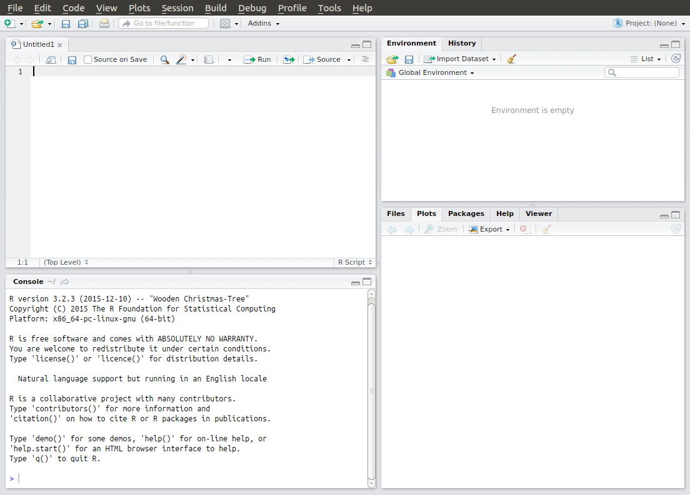
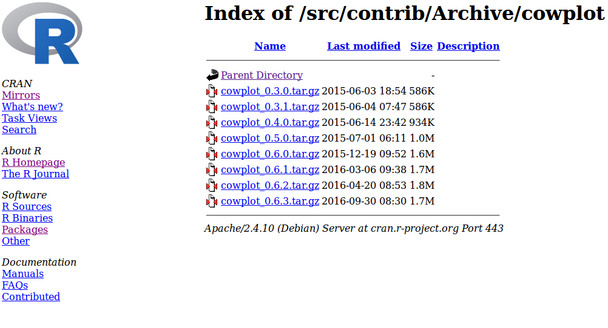

--- 
title: "Introduction to R"
author: "TJ McKinley"
site: bookdown::bookdown_site
output:
    bookdown::pdf_book:
        includes:
            in_header: header.tex
    bookdown::gitbook:
        config:
            sharing: null
        css: 'style.css'
        includes:
            in_header: _toggle.html
        keep_md: TRUE
linkcolor: blue
documentclass: book
link-citations: yes
description: "Introduction to R Tutorial"
---

# Introduction {-}


## Acknowledgements {-}

I am indebted to [Dr Matt Castle](https://www.globalfood.cam.ac.uk/memberdirectory/castle-matt), whose excellent "Introduction to R" practicals form the basis of this workshop. 

## Recommended reading {-}

I heartily recommend the following books:
    
* [Statistics: An Introduction Using R](https://www.amazon.com/Statistics-Introduction-Michael-J-Crawley/dp/0470022981/ref=sr_1_1?s=books&ie=UTF8&qid=1484432671&sr=1-1&keywords=an+introduction+to+statistics+with+r+crawley) by Mick Crawley (2005);
* [The R Book](https://www.amazon.com/R-Book-Michael-J-Crawley/dp/0470973927/ref=sr_1_1?s=books&ie=UTF8&qid=1484432596&sr=1-1&keywords=the+r+book) by Mick Crawley (2007).

"The R Book" is a fairly hefty tome, but is pretty comprehensive. "Statistics: An Introduction Using R" is an attenuated version of "The R Book" and provides a good introduction to using R, as well as a good grounding in common statistical methods using R.

[Hadley Wickham](http://hadley.nz/) and colleagues have also written many great R packages and several great books, some of which we will delve into in much more detail in other workshops:
    
* [R for Data Science](https://www.amazon.com/R-Data-Science-Hadley-Wickham/dp/1491910399/ref=as_li_ss_tl?ie=UTF8&qid=1469550189&sr=8-1&keywords=R+for+data+science&linkCode=sl1&tag=devtools-20&linkId=6fe0069f9605cf847ed96c191f4e84dd) by Hadley Wickham and Garrett Grolemund (2016), also with a great companion [website](http://r4ds.had.co.nz/);
* [ggplot2](https://www.amazon.com/dp/0387981403/ref=cm_sw_su_dp?tag=ggplot2-20) by Hadley Wickham (2009);
* [Advanced R](https://www.amazon.com/dp/1466586966/ref=cm_sw_su_dp?tag=devtools-20) by Hadley Wickham (2014), which has a useful companion [website](http://adv-r.had.co.nz/).

These books are all available in the University library.

## Structure of this workshop {-}

Many introduction to R workshops focus on the use of R as a *statistical* computing environment. This workshop focuses instead on learning how to use R as a programming and scientific computing environment. Once you have mastered the ideas in this workshop, you will able to pick up the material in the more advanced workshops much more easily. As such this forms a pre-requisite for many subsequent workshops.

R can be tricky to learn, so please feel free to e-mail any of the demonstrators with questions, though please make sure that you have thought through your question in advance. Most R problems can be solved with judicious use of Google and StackOverFlow...

In the workshop, R commands to be entered into the console are show in grey boxes e.g.


```r
seq(0, 1, length = 11)
```

and similarly for the corresponding outputs:


```
##  [1] 0.0 0.1 0.2 0.3 0.4 0.5 0.6 0.7 0.8 0.9 1.0
```

There is a downloadable PDF version of these notes if you prefer (available via the link next to the title at the top of the page), though I think the HMTL version is easier to work from.

## Tasks {-}

<div class="panel panel-default"><div class="panel-heading"> Task </div><div class="panel-body"> 
All **tasks** will be denoted in panel boxes like this one. In the HTML version, all solutions can be toggled by hitting the **Show Solution** buttons. In the PDF version solutions are given in the Appendix and are linked via the **Show Solution** buttons. </div></div>

<button id="displayTextunnamed-chunk-6" onclick="javascript:toggle('unnamed-chunk-6');">Show: Solution</button>

<div id="toggleTextunnamed-chunk-6" style="display: none"><div class="panel panel-default"><div class="panel-heading panel-heading1"> Solution </div><div class="panel-body">
The answer is, of course, 42. </div></div></div>

<!--chapter:end:index.Rmd-->

# What is R? {#whatIsR}

R---available at [https://cran.r-project.org/](https://cran.r-project.org/)---is a comprehensive statistical programming language. It can be thought of as an open-source, freely available implementation of the [S](https://en.wikipedia.org/wiki/S_(programming_language)) language, which was developed at Bell Laboratories. R is an **interpreted language**, and so can be used interactively, without the requirement of compiling the code into an executable file. 

Although R is a functional programming language in its own right, its popularity is in large part due to its fantastic capabilities as a statistical package. However, R is much more than that. R has amazing graphical capabilities; can integrate with other languages, such as C and Python; can use scripts and be run in batch mode; can be used to produce **reproducible** documents, presentations and even interactive webpages. Even better than that, R is completely FREE! Take it home, share it with your mates, give it to your collaborators. Professional editions of packages such as SAS, Stata, S-Plus or SPSS can cost upwards of £1000. 

To top it off, R is also **multi-platform**, and so can be used on Windows, Mac and Linux operating systems. R is supported by a wide user base, and is extended by a large number of additional packages, and even provides the capabilities to create your own.

In these practicals, we will use an IDE (integrated desktop environment) called [RStudio](https://www.rstudio.com/). This provides a neat interface for the R software, is available for free, and runs on all operating systems. Download and installation instructions are available on the RStudio website: [https://www.rstudio.com/](https://www.rstudio.com/). 

All of the instructions in this practical will assume that you are using RStudio.

## Installing R and RStudio

If you want to download R for your own computer, first go to [http://cran.r-project.org](http://cran.r-project.org), and follow the instructions in the box called 'Download and Install R'. Once you have installed R, you can install RStudio from [https://www.rstudio.com/](https://www.rstudio.com/).

<!--chapter:end:ch_whatIsR.Rmd-->

# Getting Started in R

R is an **object-orientated** programming language. This means that you create objects, and give them names. You can then **do things** to those objects: you can perform calculations, statistical tests, make tables or draw plots. Objects can be single numbers, characters, vectors of numbers, matrices, multi-dimensional arrays, lists containing different objects and so on. 

Whilst R provides its own development environment, we will use a fantastic IDE[^i] provided by RStudio. This is free to download, provides some neat features, and crucially, looks the same on all operating systems!

[^i]: Integrated Desktop Environment

## RStudio

<div class="figure" style="text-align: center">

<p class="caption">(\#fig:rstudio)RStudio window</p>
</div>

The RStudio window should look something like Figure \@ref(fig:rstudio). It consists of:

* **Script pane** (top-left): this is essentially RStudio's built-in text editor. It has all the usual features one would expect: syntax highlighting, automatic indentation, bracket matching, line highlighting and numbering and so on. You can open any type of text file in here, not just R scripts. (You might have to go to *File > New File > R Script* to open a new R script if you don't have one already open.)
* **Console pane** (bottom-left): This is where you run R commands and view outputs.
* **Workspace/history pane** (top-right): this shows a list of all of the objects and variables that you create during a session or a history of all of the commands that have been sent to the command window during the session.
* **Plot/help pane** (bottom-right): this shows any plots that you create or any help files that you access.

You can alter the size of the various panes by clicking and dragging the grey bar in between each window to suit your needs. You can also change their arrangement by going to *Tools > Global Options*, and then selecting the *Pane Layout* option.

## Cheat Sheets

The helpful folks at RStudio also produce a series of excellent Cheat Sheets, available [here](https://www.rstudio.com/resources/cheatsheets/). Please note, these are updated semi-regularly as new packages are added or existing packages updated. Note also that these cheat sheets focus on the use of RStudio, and a small number of subset of packages that are developed by RStudio (e.g. `tidyverse`, `shiny` and `rmarkdown`). For example, a nice Cheat Sheet for RStudio itself can be found [here](https://www.rstudio.com/wp-content/uploads/2016/01/rstudio-IDE-cheatsheet.pdf).

I will provide links to some of these cheat sheets as we progress through the practicals, but please note that they might change over time, and older versions exist online. They are a brilliant resource where applicable.

## Setting up an R session {#setup}

It is worthwhile getting into a workflow when using R. General guidelines I would suggest are:

* Use a different folder for each new project / assignment. This helps to keep all data / script / output files in one self-contained place.
* Set the **Working Directory** for R at the outset of each session to be the folder you've specified for the particular assignment you're working on. This can be done in RStudio by going to *Session > Set Working Directory > Choose Directory*. This sets the default search path to this folder.
* Always use [**script files**](#script) to keep a record of your work, so that it can be reproduced at a later date.
* [**Additional**: I also initialise a [Git](https://git-scm.com/) repository in each project folder (unless the project is very small). This allows me to use version control to aid the development of the code as well as to allow me to roll back to earlier versions of the code if necessary. Linking to an online repository such as [GitHub](https://github.com/) or [BitBucket](https://bitbucket.org/product) also provides an cloud-based backup service, as well as an ability to share code and collaborate. We are aiming to run a Git workshop at some point in the future, so keep your ears to the ground if you're interested...]

We will explore the **console** and **script** panes below, dealing with the other panes as and when they arise.

### Console Pane

The console pane provides a direct interface with R, and looks similar to command line R (in Linux and Macs), and the console pane in R for Windows. You enter commands via the standard prompt `>`. For example, type the following into the console pane:


```r
10 + 5 * 3
```

```
## [1] 25
```

You can see here that R has returned a value of 25, illustrating one of R's key features: that it can be used as an overgrown calculator, simply by entering commands into the prompt. R supports lots of basic mathematical operators, such as those found in Table \@ref(tab:mathop).

Table: (\#tab:mathop) Basic mathematical operators

 Symbol    | Meaning 
:--------: | :--------:
`+`    | addition 
`-` | subtraction 
`*` | multiplication 
`/` | division 
`^` | to the power 
`%%` | the remainder of a division (modulo)
`%/%` | the integer part 

Meanwhile, Table \@ref(tab:mathfunc) has some other ones you might need. (These are functions: just replace `x` with a number.)

Table: (\#tab:mathfunc) Other useful mathematical functions

Function 	|	           Meaning 
:---------: | :----------------------------:
`log(x)` 	|	$\log_e(x)$ (or $\ln(x)$)
`exp(x)` 	|	$e^x$ 
`log(x, n)` 	|	$\log_n(x)$
`log10(x)` 	|	$\log_{10}(x)$ 
`sqrt(x)` 	|	$\sqrt{x}$ 
`factorial(x)` 	|	$x!$ 
`choose(n, x)` 	|	binomial coefficients: $\frac{n!}{x!(n - x)!}$
`gamma(x)` 	|	$\Gamma\left(x\right)$ for continuous $x$ or \newline $(x-1)!$ for integer $x$
`lgamma(x)` 	|	natural log of $\Gamma\left(x\right)$ 
`floor(x)` 	|	greatest integer $< x$
`ceiling(x)` 	|	smallest integer $> x$
`trunc(x)` 	|	closest integer to $x$ between $x$ and 0 \newline e.g `trunc(1.5) = 1`, `trunc(-1.5) = -1` \newline `trunc` is like `floor` for positive values and like `ceiling` for negative values
`round(x, digits = 0)` 	|	round the value of $x$ to an integer 
`signif(x, digits = 6)` 	|	round $x$ to 6 significant figures 
`cos(x)` 	|	cosine of $x$ in radians 
`sin(x)`	|	sine of $x$ in radians 
`tan(x)` 	|	tangent of $x$ in radians 
`acos(x)`, `asin(x)`, `atan(x)` 	|	inverse trigonometric transformations of real or complex numbers
`acosh(x)`, `asinh(x)`, `atanh(x)` 	|	inverse hyperbolic trigonometric transformations on real or complex numbers 
`abs(x)` 	|	the absolute value of $x$, ignoring the minus sign if there is one 

R retains a **history** of all the commands you have used in a particular session. You can scroll back through these using the up (&#x2191;) and down (&#x2193;) arrows whilst in the console pane. (You can even save the history---though we will discuss a better option in the next section.)

One important thing to note is that unlike a language like C, R does not require the semicolon (`;`) symbol to denote the end of each command. A carriage return is sufficient. A semicolon can be used to allow multiple commands to be written on the same line if required. For example, 


```r
10 + 5 * 3; sin(10)
```

```
## [1] 25
## [1] -0.5440211
```

is equivalent to


```r
10 + 5 * 3
sin(10)
```

```
## [1] 25
## [1] -0.5440211
```

One thing to note is that if a command is incomplete, then R will change the `>` prompt for a `+` prompt. For example, typing `10 + 5 *` into the console pane will result in the `+` prompt appearing, telling you that the previous line is incomplete i.e.


```r
> 10 + 5 *
+ 3
```

```
## [1] 25
```

You must either complete the line or hit the `Esc` key to cancel the command. 

### Script pane and R scripts {#script}

The console window is the engine room of R, and one can interact directly with it. One key advantage to R is that it *records* all of the commands that you enter into the console (known as the command *history*). It is possible to save the command history, or run back through it using the arrow keys. However, a much better approach is to use the **script pane** to write an R script that contains all the commands necessary for a particular project. In fact, one might argue that this is probably one of the most important features of R relative to a point-and-click statistical package such as SPSS.

Put simply, ***R scripts are just text files that contain commands to run in R***. They are **vitally important** for the following reasons:

* They keep a systematic record of your analysis, which enables you to **reproduce** your work at a later date, or can be passed to collaborators or other users to enable them to replicate your work.
* This record means that you do not have to rely on your memory to figure out **what** you did.
* R scripts allow you to **comment** your code, which means that you also won't forget **why** you did it.
* In more advanced settings, R scripts can also be run in **batch** mode, which means that you can ping a script off to run remotely on a server somewhere without having to be sat in front of a computer manually entering commands.
* Although programs like SPSS allow **outputs** to be saved, R scripts contain **inputs**, which are much more useful, since it is easier to generate the outputs from the inputs than it is to reconstruct the likely inputs from the outputs.
* In fact, R scripts can be combined with a markup language called 'markdown' to generate fully reproducible documents, containing both inputs and outputs. It does this using the fantastic [`knitr`](https://yihui.name/knitr/) and [`rmarkdown`](https://rmarkdown.rstudio.com/) packages. (In fact this workshop was written using `rmarkdown` and a package called [`bookdown`](https://bookdown.org/yihui/bookdown/).)

Some comments:

* RStudio comes with its own text editor, but if you are not using RStudio, then there are plenty of others available. 
* R is case-sensitive. If something doesn't work, it's often because you have failed to capitalise, or capitalised where you shouldn't have. **NEVER, EVER, EVER** use Word to edit your R scripts! Word often tries to correct your grammar and is an absolute nightmare to work with when writing code. If you don't like RStudio's editor, then lots of lightweight and free text editors exist that you can use. By all means use Word for writing up the work (although we will see even better ways to do this in a later **Literate Programming** workshop), but ***please***, ***NEVER*** use it for writing code.

In RStudio, you can open a new script in R using: *File > New File > R Script*. 

Type the following into the **script file**:


```r
## calculate the hypotenuse from a right-angled triangle
## with the two other sides equal to 3 and 4
sqrt(3^2 + 4^2)
```

Notice that nothing has happened. All you've done is write some commands into a text window. However, if you highlight these lines and then hit the `Run` button in the top right-hand corner of the script pane (or, in Windows certainly, press `Ctrl-Enter`), then RStudio runs these lines in the console pane. (Alternatively, you can manually copy-and-paste these lines into the console window.) This should return:


```
## [1] 5
```

> **Note**: notice that the `#` symbol here denotes a **comment**, such that any text after the `#` is ignored (up to the end of the current line). I have used a double hash here `##`, though this is simply because I've written this practical using [RMarkdown](http://rmarkdown.rstudio.com/) (more on this later), and it seems to typeset better. This is not absolutely necessary though, since anything after the first `#` is ignored. 

> Comments are ***vital*** in code to ensure reproducibility and readability. You should ensure that all code is commented, so that both you and anyone else who wants to use your code is able to decipher it. Even if no one else is going to look at your code, it is still worthwhile to comment it. What seems obvious to you as you write a piece of code, often becomes confusing when you return to it in 6 months time and can't remember what you did or why you did it...

It is conventional to save R script files using the suffix '.R', though remember that they are simply **text files**, and can be viewed in any text editor. Make sure you have set up a folder to store the code for this practical in, and have changed the **working directory** to this folder (see the [setup](#setup) section), and then save this script file as something like "IntroToR.R".

> Make sure you save your script file regularly to prevent data loss!

#### Notes on legibility {#legible}

**NOTE**: that I use spaces within the code to make it clearer. R does not require this, but again I think it is good practice to think about how to make you code legible. Different coders have different preferences, but personally I prefer `plot(Worm.density ~ Vegetation, data = worms)` over `plot(Worm.density~Vegetation,data=worms)`. As [Hadley Wickham](http://style.tidyverse.org/) says: "Good coding style is like correct punctuation: you can manage without it, butitsuremakesthingseasiertoread."

Note that different coders prefer different styles---there is no universal agreement. However, it's worth getting into the habit of writing your code neatly and with a thought towards legibility. A guide that is similar to my own is the `tidyverse` guide [here](http://style.tidyverse.org/). (Note that unlike Python, R does not require specific indentation. Instead it uses curly brackets to group lines of code together. However, indentation is still key to good legibility. An example of a tidy R script is given e.g. [here](#tidyscript).)

I tend to use script files to keep a record of all commands that need to be reproduced, but I often enter commands directly into the console window when I'm testing or visualising things. Try to keep redundant code out of your script files. In this workshop I expect you to use script files from the outset! Make sure the code is legible and commented.

## R packages {#packages}

R has hundreds of add-on **packages** that provide functionality for a wide range of techniques. These repositories are growing all of the time; some packages become redundant and are removed, others are updated, some are superceded or incorporated into others, and completely new ones appear regularly. A key part of becoming proficient with R is learning how to install and update packages.

> **Note**: R packages can be thought of in a similar way to Matlab toolboxes or Python libraries.

The principal R package repository can be found on [CRAN](https://cran.r-project.org/) (the Comprehensive R Archive Network). Another popular repository, predominantly aimed at bioinformatics packages, is [Bioconductor](https://www.bioconductor.org/), though installation of packages through Bioconductor is more difficult than through CRAN, so we will focus on the latter only here.

Some packages are included as part of R's base package. To load a package, you can use the `library()` function, passing the name of the required package (quotes are not necessary for this function). For example, to load the `tidyr` package, type:


```r
library(tidyr)
```

If this doesn't return any error, then the package is loaded and you are now able to use any function in `tidyr` in your R code. R packages must contain help files and documentation in order to be included on CRAN. For example, the documentation for the `tidyr` package can be found [here](https://cran.r-project.org/web/packages/tidyr/), through the *Reference Manual* link, plus some vignettes through the *Vignettes* link.

If it's not installed, then you will need to install it:


```r
install.packages("tidyr")
```

> This will ask that you select a repository---choosing one close-to-home is a good idea. It might also ask you to set up a local R library in your user directory. This is a good idea, so I would just accept the default if it asks.

If it installs without any errors, then you can load the library using `library(tidyr)` as above. 

> **Note**: You only have to install a package **once** (unless you update R). You have to **load** the library once during each session. I prefer to enter all my calls to `library()` at the top of my script file, so I can quickly see which packages are required for my script to run.

> **Note**: you can also install a package from a local ZIP file, simply download the 'Package Source' from CRAN, and then type:


```r
install.packages("PATH/TO/PACKAGENAME", repos = NULL)
```

where `PATH/TO/PACKAGENAME` is the path to the package source file (be careful to get the path in the correct format---Windows users might have to use `\` instead of `/`). The `repos = NULL` argument tells R to look for the file locally, and not online.

### Installing archived versions of a package

Sometimes R packages are not updated as quickly as R itself, and occasionally you might need to install an older version of a package. A really useful package to install is called [`devtools`](https://cran.r-project.org/web/packages/devtools/index.html). This provides functions to install R packages directly from CRAN archives, which can be found by going to [https://cran.r-project.org/](https://cran.r-project.org/), and clicking on the *Packages* link followed by the *Archived* link. This provides a list of older versions of a package, which can be installed using the `install_version()` function in `devtools`.

For example, I recently had an issue with a package [`cowplot`](https://cran.r-project.org/web/packages/cowplot/) not existing for my version of R, returning the following error message:


```r
install.packages("cowplot")
```

```
Installing package into ‘/home/tj/R/x86_64-pc-linux-gnu-library/3.2’
(as ‘lib’ is unspecified)
Warning in install.packages :
  package ‘cowplot’ is not available (for R version 3.2.3)
```
I solved this by finding an older version of the package on CRAN (by clicking on *Packages* then *Archived*):



I noted the version number, and then used a function from `devtools` called `install_version()` as follows:


```r
library(devtools)
install_version("cowplot", version = "0.6.3", repos = "https://cran.r-project.org/")
```

### Development packages

In order to upload a package to CRAN, the package must pass a series of tests. The versions you find on CRAN are the **stable** versions (i.e. they have passed these tests and work well with the current version of R). However, developers often keep the latest **development** version of their package on an online repository such as [GitHub](https://github.com/). Development packages usually contain the most up-to-date functions, but are likely to contain more bugs---use them at your own risk! In addition, some packages simply aren't available on CRAN---there is no requirement to upload in this way. 

For example, the `gganimate` package is only available on GitHub, the source code can be found [here](https://github.com/dgrtwo/gganimate). It can be installed using `devtools` as follows (**don't run the code now**):


```r
install_github("dgrtwo/gganimate")
```

Note the syntax `DEVELOPER/PACKAGENAME`---this can be found from the address of the repository e.g. [https://github.com/dgrtwo/gganimate](https://github.com/dgrtwo/gganimate).

<!--chapter:end:ch_gettingStarted.Rmd-->

# Fundamentals of R

## Variables in R

R makes use of symbolic variables, i.e. words or letters that can be used to represent or store other values or objects. We will use the assignment operator `<-` to 'assign' a value (or object) to a given word (or letter). Run the following commands to see how this works (don't worry about the comments, these are for your understanding):


```r
## assign to x the value 5
x <- 5 

## print the value assigned to the 
## variable x to the screen
x 
```

```
## [1] 5
```

```r
## we can also assign text to a variable
y <- "Hello There" 

## print y
y
```

```
## [1] "Hello There"
```

```r
## we can re-assign variables
y <- sqrt(10)

## or assign a variable in terms 
## of other variables
ziggy <- x + y

## print variable "ziggy"
ziggy
```

```
## [1] 8.162278
```

You will notice that as we create each of these variables, they begin to appear in the **environment** pane in the top right-hand side of the RStudio window. This shows the current R **workspace**, which is a collection of objects that R stores in memory. We can remove objects from the workspace using the `rm()` function e.g.


```r
## remove the variables x and y
rm(x, y)
```

Notice that `x` and `y` have now disappeared from the workspace. The variable `ziggy` still contains the correct answer though (these are not ***relative*** objects, such as the macros assigned in a program like Excel).


```r
ziggy
```

```
## [1] 8.162278
```

Another way of visualising the working directory is to use the `ls()` function, which lists all objects currently in the workspace e.g.


```r
ls()
```


```
## [1] "ziggy"
```

> Names of variables can be chosen quite freely in R. They can be built from letters, digits and other characters, such as `_`. They can't, however, start with a digit or a `.` followed by a digit. Names are **case sensitive** and so `height` is a different variable from `Height`. Try to choose **informative** variable names where possible (`height` is more informative than `x` when talking about heights for example).

> Try to use avoid spaces between words in your variable names. Underscores are much safer[^1]. Try to avoid using long words (since you will have to type them out each time you want to access the corresponding elements---although RStudio does have *autocomplete* functionality). Often I will try to convert as much to lower case as possible. If you do need to include multiple words try to use an underscore `_` (e.g. `child_heights`), or some people prefer to use something like [CamelCase](https://en.wikipedia.org/wiki/Camel_case) (e.g. `childHeights` or `ChildHeights`). Use whatever you prefer but try to be **consistent**.

[^1]: Some people also use dots, e.g. `child.heights`, but in general I would avoid this, since dots are often used when working with functions of specific classes such as `print.lm()`

## Functions in R

Next we need to understand how to do more complicated things in R. For this we need functions. This section illustrates how R's inbuilt functions work. Most commands that are used in R require the use of functions. These are very similar to mathematical functions (such as `log(x)`), in that they require both the name of the function (i.e. `log`) and some **arguments** (i.e. `x`). However a lot of functions in R have multiple arguments which can be of completely different types.

The format is that a function name is followed by a set of parentheses containing the arguments. For example, if we type `seq(0, 3, 0.5)`, the function name is `seq` and the specified arguments are `0`, `3` and `0.5`. `seq()` is an inbuilt R function that generates sequences of numbers, and we're going to continue to use it to illustrate how functions work. Try typing in the command:


```r
seq(0, 3, 0.5)
```

```
## [1] 0.0 0.5 1.0 1.5 2.0 2.5 3.0
```

You can see that this function produces a sequence that starts at 0, ends at 3 and has steps of 0.5. Spaces before the parentheses or between the arguments are not important when writing functions so `seq(0,3,0.5)` will work just as well as `seq    (0,    3,    0.5)`. However, as stated [earlier](#legible), I think spaces in sensible places can make the code much more legible i.e. `seq(0, 3, 0.5)` is better than either of the above options.

All functions in R have **defaults** for the majority of their arguments (some functions have dozens of arguments, and having default values avoids you having to specify them all every time you use the function). For example, the `seq()` function has the following four main arguments (in this order):

Argument | Description
:-: | :--------------------------------------------------------------:
`from, to` | the starting and (maximal) end values of the sequence. Of length 1 unless just `from` is supplied as an unnamed argument.
`by` | number: increment of the sequence.
`length.out` | desired length of the sequence. A non-negative number, which for seq and seq.int will be rounded up if fractional.
`along.with` | take the length from the length of this argument.

When we write `seq(0, 3, 0.5)` R assumes that the first argument corresponds to `from`, the second argument corresponds to `to` and the third argument corresponds to `by`. This is known as **positional matching**. This means that `seq(0, 3, 0.5)` will produce a vector consisting of the sequence of numbers starting at 0, ending at 3 by adding 0.5 each time. If we write `seq(10, 0, 0.5)`, then R will attempt to create a sequence starting at 10, ending at 0 by adding 0.5 each time.

<div class="panel panel-default"><div class="panel-heading"> Task </div><div class="panel-body"> 
Try typing `seq(10, 0, 0.5)`. R returns an error. Why? </div></div>

<button id="displayTextunnamed-chunk-26" onclick="javascript:toggle('unnamed-chunk-26');">Show: Solution</button>

<div id="toggleTextunnamed-chunk-26" style="display: none"><div class="panel panel-default"><div class="panel-heading panel-heading1"> Solution </div><div class="panel-body">
R returns an error because you've asked the `seq()` function to move from 10 to 0 by adding 0.5 each time, which it clearly can't do. The step size would have to be -0.5 in order to generate decreasing numbers.</div></div></div>

The other type of matching is called **named matching** and this would allow you to write `seq(from = 0, to = 3, by = 0.5)` or `seq(to = 3, from = 0, by = 0.5)` as equivalent function commands (i.e. the **order** of the arguments **doesn't matter** if using *named* matching).

Using named matching also allows us to access the other argument: `length.out` if we wanted to use it, though you should recognise that you cannot, in general, use all four arguments in this case to specify a vector. Why not? 

In fact, this command needs three arguments to work, and it doesn't matter which three of the four arguments you use. To find out what arguments a function can take and what they mean use the `?FUNCTION` syntax (where you replace `FUNCTION` with whichever function you're interested in e.g. `?seq` or `?atan`). This will open the internal R help file for the function. The [Help](#help) section of this workshop contains detailed information on these help files.

Being able to access these internal help files will be of particular help for all of the statistical functions we will want to use which generally have many arguments.
    
<div class="panel panel-default"><div class="panel-heading"> Task </div><div class="panel-body"> 
Use the R function `seq()` to create the following sequences:

1. 2, 4, 6, ..., 30.
2. A sequence of 14 numbers starting at -2.5 and ending at 15.34.
3. A sequence of 7 numbers starting at 0, increasing in increments of 0.04.
4. A sequence starting at 101, ending at -20, in decrements of 11.
 </div></div>

<button id="displayTextunnamed-chunk-28" onclick="javascript:toggle('unnamed-chunk-28');">Show: Solution</button>

<div id="toggleTextunnamed-chunk-28" style="display: none"><div class="panel panel-default"><div class="panel-heading panel-heading1"> Solution </div><div class="panel-body">

```r
seq(2, 30, by = 2)
## 2.
seq(-2.5, 15.34, length.out = 14)
## 3.
seq(0, by = 0.04, length.out = 7)
## 4.
seq(101, -20, by = -11)
```
</div></div></div>

### Nesting functions {#nested}

A useful feature of R is its ability to **nest** functions. This can help make the code more concise and avoids the need to create lots of temporary variables. Nonetheless, if used too extensively then this can render code difficult to interpret, so a balance is necessary. For example,


```r
exp(sqrt(10))
```

```
## [1] 23.62434
```

This is a simple nested function, since `sqrt(10)` produces a single number, which is then used as an argument to the `exp()` function. Mathematically, this gives $e^{\sqrt{10}}$. We could have also done this in two steps, but this would have involved creating a temporary variable to store the result of the sum:


```r
x <- sqrt(10)
exp(x)
```

```
## [1] 23.62434
```

To understand nested functions, think about evaluating the **inner** functions first, seeing what they output and then how that slots into the next function. We will see an example of this [later](#nestex).

## Help files {#help}

It is a requirement of R packages that any function made available to an end user as part of a package must be documented in a **help file**. As such, the `?` command is simply a way to get more information on any given function. 
For example, if you wanted to know more about how to use the `hist` function (this function is used for plotting histograms), then you could type:

```
?hist
```

This will produce something like Figure \@ref(fig:histhelp) to appear in the in the bottom-right pane. 

<div class="figure" style="text-align: center">

<p class="caption">(\#fig:histhelp)Help file for the `hist()` function</p>
</div>

This new window contains all of the information you need to understand how to use the `hist()` function. Although these help files can seem daunting (and not particularly helpful) at first, once you get used to them they will provide the route for your continued exploration of R. Help files provide all of the details that the author of the command saw fit to include. They all aim to be comprehensive but some authors assume that you are more
familiar with what's going on than others. Most help files will have the following sections:

Table: (\#tab:helpfile) General structure of R helpfiles

Section | Description
:-----------: | :---------------------------------------------------------------:
Usage: | This will show you the minimum required arguments and also what the default value are for each of the optional arguments. In this case only `x` is a required argument and all of the others are optional.
Arguments: | This gives an explanation of what each argument does and what sort of data type it should be. In this case the argument `x` needs to be a numerical vector.
Details: | This section tells you what the function should do along with any subtleties in its usage or clarifications.
Value: | This tells you what actually happens when you run the function and specifically what sort of R object the function produces. In this case it produces a special `histogram` object (which is actually just a normal list with certain specific components).
References: | This gives you some selected text books that the author feels explains the theory behind the function in greater detail.
See Also: | This should be a list of other R commands that are related to the current function. They might be of more use to you, or their help files might be better written and clarify what you're trying to do.
Examples: | This should be a set of R commands that you can copy-and-paste into either a script file or the console pane. These should give you a practical example of how to use the function in several different settings.

If you're really stuck, there is an international community of R users who regularly post questions and answers on advanced topics. In the Help menu, choose 'search r-project.org' and work through the search pages. Beware though, these are busy people who will often ignore directly emailed requests for help. Ask your resident experts first, before e-mailing the R-search email lists! 

I also tend to succeed mostly by Googling the problem. For example, Googling 'R importing data' finds me this rather excellent tutorial: [http://www.r-tutor.com/r-introduction/data-frame/data-import](http://www.r-tutor.com/r-introduction/data-frame/data-import).

\pagebreak 

## Objects in R

R defines various types of object (and allows you to define your own if you so wish). We will explore the most common object types below.

### Vectors

**Vectors** are fundamental R objects. In fact, we have already seen them at work in earlier examples. For instance, notice that if we type the number `10` into the command prompt, the output when R prints this to the screen is prefixed with a `[1]`:


```r
10
```

```
## [1] 10
```

This shows that the output is a **vector** of length 1. The `ziggy` variable we created earlier is also a vector of length 1:


```r
ziggy
```

```
## [1] 8.162278
```

Note that vectors do not have to be numerical in value e.g.


```r
"somewords"
```

```
## [1] "somewords"
```

is also a vector of length 1. R distinguishes between different 'types' of vector, with the four main types being:

* `numeric` where each element is a number (either integer or decimal),
* `character` where each element is a word or letter, and
* `factor` where each element is a word or letter, but with some additional "grouping" information, and
* `logical` where each element is either `TRUE` or `FALSE` (equivalently coded as `T` or `F`).

In this section we will look at several different commands which produce vectors and then see how we can manipulate these objects in R.

#### Creating vectors

Probably the most common ways of creating vectors are to use the `c()`, `seq()` and `:` commands. Of these, `:` creates integer sequences, `seq()` creates structured sequences (only useful for numeric vectors), and `c()` is short-hand for *concatenate*, and it binds together all of the elements that you put inside the brackets to make a single vector.

Run the following commands to see how we can create different types of vectors:


```r
1:5
6:2
```

```
## [1] 1 2 3 4 5
## [1] 6 5 4 3 2
```

Notice that brackets can be important, for example, note the differences below.


```r
-4:1
-(4:1)
```

```
## [1] -4 -3 -2 -1  0  1
## [1] -4 -3 -2 -1
```

The first line above creates an integer sequence from -4 to 1, and the second creates one from -4 to -1. The `seq()` command we saw earlier, and here are some more examples:


```r
seq(0, 1, by = 0.1)
seq(0, 1, length = 6)
seq(10, 5, by = -0.5)
```

```
##  [1] 0.0 0.1 0.2 0.3 0.4 0.5 0.6 0.7 0.8 0.9 1.0
## [1] 0.0 0.2 0.4 0.6 0.8 1.0
##  [1] 10.0  9.5  9.0  8.5  8.0  7.5  7.0  6.5  6.0  5.5  5.0
```

The `c()` function is very useful for concatenating non-sequential numbers or vectors of other data types e.g.


```r
c(1, 3, 5, 7)
c(0.1, -6, 1, 0)
c("bob", "sam", "ted")
```

```
## [1] 1 3 5 7
## [1]  0.1 -6.0  1.0  0.0
## [1] "bob" "sam" "ted"
```

> Notice that we needed to use double-quotes to signify `character` types e.g. `c("bob", "sam", "ted")`. Note that R does not distinguish between single or double-quotes, so `c('bob', 'sam', 'ted')` would have worked equally well. 

If you forget the quotes (e.g. `c(bob, sam, ted)`) then R would instead have looked for three **objects** called `bob`, `sam` and `ted` and tried to concatenate these together. If these objects do not exist, then R will return an error:


```r
c(bob, sam, ted)
```

```
## Error in eval(expr, envir, enclos): object 'bob' not found
```

To this end, it is worth noting that we can also use `c()` to concatenate objects that are of the same type together. For example:


```r
c(1, -6, ziggy)
```

```
## [1]  1.000000 -6.000000  8.162278
```


```r
c(ziggy, seq(3, 6, length = 5))
```

```
## [1] 8.162278 3.000000 3.750000 4.500000 5.250000 6.000000
```

(In the example above we have used [**nested**](#nested) functions to make the code more concise.) If we try to concatenate objects of a different type, R will either return an error, or it will convert one of the objects into the same class as the other. For example,


```r
c(c("bob", "sam", "ted"), ziggy)
```

```
## [1] "bob"              "sam"              "ted"              "8.16227766016838"
```

(Here we use [**nested**](#nested) `c()` functions to first create a `character` vector out of the strings `"bob"`, `"sam"` and `"ted"`, and then to concatenate this with the object `ziggy`.) Notice that the concatenated vector is a `character` vector (notice the **double-quotes** around `"8.16227766016838"`), indicating that R has converted the elements of `ziggy` into `characters` in order to concatenate them with a `character` vector. 

> R will always convert to the most complex object type: so a combination of `character` and `numeric` values will be converted to a `character`.

Notice that R has not changed the value of the object `ziggy`---if we print `ziggy` to the screen we can see it is still a `numeric` vector:


```r
ziggy
```

```
## [1] 8.162278
```

Rather, it created a copy of `ziggy` which it converted into a `character` before concatenating. In order to change the value of an object permanently, we need to reassign the object. For example, the function `as.character()` will convert a `numeric` vector into a `character` vector without changing the object e.g.


```r
as.character(ziggy)
```

```
## [1] "8.16227766016838"
```

```r
ziggy
```

```
## [1] 8.162278
```

To reassign it we can pass the output of the function and overwrite the original object using the assignment operator `<-` e.g.


```r
ziggy <- as.character(ziggy)
ziggy
```

```
## [1] "8.16227766016838"
```

We can see that now the object `ziggy` has been changed to a `character` permanently.

<div class="panel panel-default"><div class="panel-heading"> Task </div><div class="panel-body"> 
Use the various vector creation commands to create the following sequences:

1. 1, 2, 3, 4, 5, 6, 7, 8, 9, 10, 11.
2. 2, 4, 6, 8, 10, ... , 50.
3. All of the odd numbers from 17 through to 33.
4. The letters of the days of the week (i.e. M, T, W, T, F, S, S).
 </div></div>

<button id="displayTextunnamed-chunk-46" onclick="javascript:toggle('unnamed-chunk-46');">Show: Solution</button>

<div id="toggleTextunnamed-chunk-46" style="display: none"><div class="panel panel-default"><div class="panel-heading panel-heading1"> Solution </div><div class="panel-body">

```r
## 1.
1:11
## 1. (alternative)
seq(1, 11, by = 1)
## 2.
seq(2, 50, by = 2)
## 3.
seq(17, 33, by = 2)
## 4.
c("M", "T", "W", "T", "F", "S", "S")
```
</div></div></div>

#### Subsetting and re-arranging vectors

If we only want to get at certain elements of a vector then we need to be able to subset the vector. In R, square brackets `[]` are used to get subsets of a vector.

> **IMPORTANT**: In R, objects are **indexed** such that the **first** element is element `1` (unlike C or Python for example, which indexes relative to `0`). In R the first element of `x` is `x[1]`, whereas in Python it would be `x[0]`.
> 
> Note also that in Python the command `x[-1]` would extract the **last** element of the vector `x`, whereas in R the `-` is used to **remove** elements; hence `x[-1]` would ***remove*** the first element of `x`.

<div class="panel panel-default"><div class="panel-heading"> Task </div><div class="panel-body"> 
Copy the following commands into your script file and then run them in order to see how this works. Annotate each line using comments to describe what it is doing.

```
x <- 1:5
x[3]
x[c(2, 3, 4)]
x[1] <- 17
x[-3]
w <- x[-3]
y <- c(1, 5, 2, 4, 7)
y[-c(3, 5)]
y[c(1, 4, 5)]
i <- 1:3
y[i]
z <- c(9, 10, 11)
y[i] <- z
```
 </div></div>

<button id="displayTextunnamed-chunk-48" onclick="javascript:toggle('unnamed-chunk-48');">Show: Solution</button>

<div id="toggleTextunnamed-chunk-48" style="display: none"><div class="panel panel-default"><div class="panel-heading panel-heading1"> Solution </div><div class="panel-body">

```r
## generate a vector x of five elements from 1 to 5
x <- 1:5

## extract the third element of x
x[3]

## extract the 2, 3 and 4th elements of x
x[c(2, 3, 4)]

## change the first element of x to 17
x[1] <- 17

## extract all elements of x except the third
x[-3]

## extract all elements of x except the third
## and save to new object w
w <- x[-3]

## create a vector of length 5 called y with
## corresponding entries below
y <- c(1, 5, 2, 4, 7)

## extract all elements of y except the third
## and fifth
y[-c(3, 5)]

## extract elements 1, 4 and 5 from y
y[c(1, 4, 5)]

## create a vector i containing three elements:
## 1, 2 and 3
i <- 1:3

## extract elements 1, 2 and 3 from y
y[i]

## create a vector z of length 3 with elements
## 9, 10 and 11
z <- c(9, 10, 11)

## replace elements 1, 2 and 3 in y with z
y[i] <- z
```
</div></div></div>

<div class="panel panel-default"><div class="panel-heading"> Task </div><div class="panel-body"> 
Can you work out what the following functions do?

1. `order(y)`
2. `rev(y)`
3. `sort(y)`

Can you work out a way to sort `y` into decreasing order? </div></div>

<button id="displayTextunnamed-chunk-50" onclick="javascript:toggle('unnamed-chunk-50');">Show: Solution</button>

<div id="toggleTextunnamed-chunk-50" style="display: none"><div class="panel panel-default"><div class="panel-heading panel-heading1"> Solution </div><div class="panel-body">

```r
## 1. this sorts the vector y into increasing order.
order(y)
## 2. this reverses the order of y.
rev(y)
## 3. this sorts the vector y into increasing order.
sort(y)

## there are various ways to sort `y` into decreasing order e.g.
sort(y, decreasing = T)
rev(sort(y))
order(-y)
```
</div></div></div>

#### Element-wise (or vectorised) operations {#vecrep} 

R performs most operations on vectors **element-wise** , meaning that it performs each calculation on each element of a vector or array **independently** of the other elements. This can make for very fast manipulation of large data sets.

> **Aside**: R is a **high-level** language, meaning that it is built on **low-level** languages, in this case C and Fortran. In C, if we wish to apply a function to each element of an array, we need to write a loop. In R there are so-called **vectorised** functions, that will apply a function to each element of a vector or array. We will cover loops in R later on, but generally they are much slower than the equivalent loops in C or Fortran. The source code for vectorised functions are often written in C or Fortran and hence run much faster than writing a loop in native R code. In addition they make the code more concise. For simple functions the difference in run time is often too small to really notice, but for more complex or large-scale functions the difference in run time can be large. To this end, R also offers various ways of using C code within R functions. But that is beyond the scope of this workshop...

<div class="panel panel-default"><div class="panel-heading"> Task </div><div class="panel-body"> 
Copy the following commands into your script file and then run them in order to see how this works. Annotate each line using comments to describe what it is doing.

```
y <- 1:10
y^2
log(y)
exp(y)
x <- c(5, 4, 3, 2, 1, 5, 4, 3, 2, 1)
x + y
x * y
z <- c(-1, 2.2, 10)
z + y
z * y
```
 </div></div>

<button id="displayTextunnamed-chunk-52" onclick="javascript:toggle('unnamed-chunk-52');">Show: Solution</button>

<div id="toggleTextunnamed-chunk-52" style="display: none"><div class="panel panel-default"><div class="panel-heading panel-heading1"> Solution </div><div class="panel-body">

```r
## creates a vector y containing entries
## 1, 2,  ..., 10
y <- 1:10

## squares each entry of y
y^2

## takes the natural log of each entry of y
log(y)

## takes the anti-log of each entry of y
exp(y)

## creates a vector called x containing 
## entries below
x <- c(5, 4, 3, 2, 1, 5, 4, 3, 2, 1)

## adds each element of x to its corresponding
## element in y
x + y

## multiplies each element of x with its corresponding
## element in y
x * y

## creates a vector of length 3 called z
## with entries below
z <- c(-1, 2.2, 10)

## repeats z 4 times, and takes the first
## 11 entries, which it then adds to
## each corresponding entry of y
z + y

## repeats z 4 times, and takes the first
## 11 entries, which it then multiplies with
## each corresponding entry of y
z * y
```
</div></div></div>

If you add or multiply vectors of different lengths then R automatically repeats the smaller vector to make it bigger. This generates a warning if the length of the smaller vector is not a divisor of the length of the longer vector. Division and subtraction work in the same way e.g.


```r
c(1:6) * c(1:2)
```

```
## [1]  1  4  3  8  5 12
```

```r
c(1:3) * c(1:2)
```

```
## Warning in c(1:3) * c(1:2): longer object length is not a multiple of shorter
## object length
```

```
## [1] 1 4 3
```

This is a useful property if the shorter vector is of length 1, in which case R multiplies each element of the longer vector by the scalar e.g.


```r
c(1:3) * 2
```

```
## [1] 2 4 6
```

> You must be **very careful** with this. I only use this feature when multiplying a vector by a scalar; otherwise I will always generate vectors of the same length, since I think this makes what you are trying to achieve explicit. Hence instead of writing `c(1:6) * c(1:2)`, I would write `c(1:6) * rep(1:2, 3)`. (I would personally rather that R did not allow elementwise operations on vectors that are of different lengths, but it does, and one should be careful...)

R will also perform **matrix multiplication** (e.g. dot products) on vectors, and this is described in a [later section](#matmult).

#### Logical vectors and conditional subsetting {#logop}

Vectors can be created according to logical criteria using the following comparison operators:

Table: (\#tab:logop) Logical operators

Operator | Definition
:--------: | :----------------------:
`!=` | not equal 
`<` | less than 
`<=` | less than or equal to 
`>` | greater than 
`>=` | greater than or equal to 
`==` | logical equals 
`|` | logical OR
`&` | logical AND
`!` | logical NOT

<div class="panel panel-default"><div class="panel-heading"> Task </div><div class="panel-body"> 
Copy the following commands into your script file and then run them in order to see how this works. Annotate each line using comments to describe what it is doing.

```
x <- 1:10
y <- c(5, 4, 3, 2, 1, 5, 4, 3, 2, 1)
x < 4
x[x < 4]
y[x < 4]
y > 1 & y <= 4
y[y > 1 & y <= 4]
z <- y[y != 3]
```
 </div></div>

<button id="displayTextunnamed-chunk-56" onclick="javascript:toggle('unnamed-chunk-56');">Show: Solution</button>

<div id="toggleTextunnamed-chunk-56" style="display: none"><div class="panel panel-default"><div class="panel-heading panel-heading1"> Solution </div><div class="panel-body">

```r
## create a vector x containing elements 1:10
x <- 1:10

## create a vector y containing the elements below
y <- c(5, 4, 3, 2, 1, 5, 4, 3, 2, 1)

## generate a logical vector where each
## element denotes whether x is < 4 (TRUE)
## or >= 4 (FALSE)
x < 4

## extracts all elements of x that are < 4
x[x < 4]

## extracts all elements of y where
## x < 4
y[x < 4]

## creates a logical vector where elements are TRUE
## if the element of y is > 1 AND <= 4, and FALSE
## otherwise
y > 1 & y <= 4

## extracts all elements of y that are > 1 and
## <= 4
y[y > 1 & y <= 4]

## extracts all elements of y that are not equal
## to 3 and pass them into a new vector z
z <- y[y != 3]
```
</div></div></div>

Finally there are many commands that are specifically aimed at vectors or sets of data. The following is a small selection for reference purposes:

Table: (\#tab:comfunc) Common R functions

Function | Description
:----------------:|:---------------------------------------------------------------:
`length(x)` | returns the length of vector `x` (i.e. the number of elements in `x`)
`names(x)` | get or set names of `x` (i.e. we can give names to the individual elements of `x` as well as just having them numbered)
`min(x)` | returns the smallest value in `x`
`max(x)` | returns the largest value in `x`
`median(x)` | returns the median of `x`
`range(x)` | returns a vector with the smallest and largest values in `x`
`sum(x)` | returns the sum of values in `x`
`mean(x)` | returns the mean of values in `x`
`sd(x)` | returns the standard deviation of `x`
`var(x)` | returns the variance of `x`
`diff(x)` | returns a vector with all of the differences between subsequent values of `x`. This vector is of length 1 less than the length of `x`
`summary(x)` | returns different types of summary output depending on the type of variable stored in `x`

<a id="nestex"></a>
<div class="panel panel-default"><div class="panel-heading"> Task </div><div class="panel-body"> 
Now that we know about **elementwise** operations, try to understand the [nested](#nested) function `sum(sqrt(log(seq(1, 10, by = 0.5))))`. To help with this, try to write this out in a series of steps and figure out what is returned at each stage of the nesting, and how this is passed to the next function. </div></div>

<button id="displayTextunnamed-chunk-58" onclick="javascript:toggle('unnamed-chunk-58');">Show: Solution</button>

<div id="toggleTextunnamed-chunk-58" style="display: none"><div class="panel panel-default"><div class="panel-heading panel-heading1"> Solution </div><div class="panel-body">

```r
## Here are the steps:

## 1. First create a sequence of numbers
## from 1 to 10 in increments of 0.5
## returns a vector
seq(1, 10, by = 0.5)

## 2. take the natural log of each 
## element of the vector - returns a vector
log(seq(1, 10, by = 0.5))

## 3. take the square root of each logged
## element - returns a vector
sqrt(log(seq(1, 10, by = 0.5)))

## 4. sums all the elements of the
## transformed vector - returns a single
## number (a vector of length 1)
sum(sqrt(log(seq(1, 10, by = 0.5))))
```
</div></div></div>


#### Factors {#factor}

We have seen that we can create `character` vectors. These are collections of strings, but with no further information. For example, if I try to summarise a character vector, R returns no useful information:


```r
x <- c("bob", "sam", "ted")
summary(x)
```

```
##    Length     Class      Mode 
##         3 character character
```

A `factor` is simply a character vector with some additional "grouping" information attached. For example,


```r
x <- factor(c("bob", "sam", "ted"))
x
```

```
## [1] bob sam ted
## Levels: bob sam ted
```

```r
summary(x)
```

```
## bob sam ted 
##   1   1   1
```

Now the `x` object has grouped together all elements of the vector that share the same name (called the `levels` of the factor), and the `summary()` function tells us how many entries there are for each level. The `levels()` function will return the levels of a factor:


```r
levels(x)
```

```
## [1] "bob" "sam" "ted"
```

R coerces `characters` to `factors` in [lexicographical order](https://en.wikipedia.org/wiki/Lexicographical_order). If you wish to set specific `levels`, then you can add a `levels` argument to the `factor()` function.

<div class="panel panel-default"><div class="panel-heading"> Task </div><div class="panel-body"> 
Copy the following commands into your script file and then run them in order to see how this works. Annotate each line using comments to describe what it is doing.

```
y <- c(5, 4, 3, 2, 10, 5, 4, 3, 2, 1)
factor(y)
factor(y, levels = 1:10)
y <- as.character(c(5, 4, 3, 2, 10, 5, 4, 3, 2, 1))
factor(y)
factor(y, levels = sort(unique(as.numeric(y))))
y <- c("low", "mid", "mid", "high", "low")
factor(y)
factor(y, levels = c("low", "mid", "high"))
```
 </div></div>

<button id="displayTextunnamed-chunk-63" onclick="javascript:toggle('unnamed-chunk-63');">Show: Solution</button>

<div id="toggleTextunnamed-chunk-63" style="display: none"><div class="panel panel-default"><div class="panel-heading panel-heading1"> Solution </div><div class="panel-body">

```r
## create a vector y containing the numbers below
y <- c(5, 4, 3, 2, 10, 5, 4, 3, 2, 1)

## visualise y as a factor
factor(y)

## visualise y as a factor but set the levels
## this means some levels will have zero
## entries
factor(y, levels = 1:10)

## create a character vector y containing the numbers
## below coded a strings
y <- as.character(c(5, 4, 3, 2, 10, 5, 4, 3, 2, 1))

## visualise y as a factor - sorts levels 
## lexicographically (hence 10 coded before 2 etc.)
factor(y)

## visualise y as a factor, but set levels that would
## be equivalent to if y was numeric instead of
## a character vector
factor(y, levels = sort(unique(as.numeric(y))))

## create a character vector y containing the strings below
y <- c("low", "mid", "mid", "high", "low")

## visualise y as a factor - sorts levels 
## lexicographically (so alphabetically in this case)
factor(y)

## visualise y as a factor - sorts levels 
## into a more sensible ordering
factor(y, levels = c("low", "mid", "high"))
```
</div></div></div>

`factor` objects are incredibly useful when working with data, since they essentially code up **categorical** variables, though care must be taken when manipulating them. We explore the use `factor` objects in more detail in a [later section](#data) and care must be taken when [converting](#convert) between factors and other types.

### Conversions between object types {#convert}

Before we progress to other objects, we should have a brief aside to talk about conversion between types. So far we have introduced `numeric` vectors, which store numerical values (note that R makes no distinction between `integer`, `float` or `double` types, like C does). We have also seen `character` types, which store strings, and `factor` types that store strings with additional grouping information attached. We have also seen `logical` types, which simply store `TRUE` or `FALSE` values.

It is possible to convert between these different forms, using an `as.TYPE()` function (where `TYPE` is replaced with the correct type of interest). For example, we can easily convert numbers to characters:


```r
x <- c(0, 1, 3, 10, 0, 4)
x
```

```
## [1]  0  1  3 10  0  4
```

```r
as.character(x)
```

```
## [1] "0"  "1"  "3"  "10" "0"  "4"
```

(Notice the double-quotes around the elements of the converted vectors.) They can also easily be converted into factors (if you want to set the levels of the factor specifically, then you can use the `factor()` function as described [earlier](#factor)):


```r
factor(x)
```

```
## [1] 0  1  3  10 0  4 
## Levels: 0 1 3 4 10
```

We can also convert numbers to logical strings, in which case R converts `0` values to `FALSE` and anything else to `TRUE`. Hence,


```r
as.logical(x)
```

```
## [1] FALSE  TRUE  TRUE  TRUE FALSE  TRUE
```

Conversions of `logical` vectors to `numeric` vectors results in `TRUE` values becoming `1` and `FALSE` values becoming `0`.

R can also convert characters to numbers, but only if the conversion makes sense. For example,


```r
y <- c("10", "2", "8")
y
```

```
## [1] "10" "2"  "8"
```

```r
as.numeric(y)
```

```
## [1] 10  2  8
```

If the conversion doesn't make sense, then R will return a **missing value** (`NA`) and print a warning:


```r
y <- c("10", "2", "bob")
as.numeric(y)
```

```
## Warning: NAs introduced by coercion
```

```
## [1] 10  2 NA
```

**Factors** are tricky little blighters! Superficially they can look like `numeric` types when printed to the screen, but in fact they are named **groups**, and as such if we convert a `factor` to a `numeric`, then R converts according to the **level** of the factor:


```r
y <- factor(c("10", "2", "8"))
y
```

```
## [1] 10 2  8 
## Levels: 10 2 8
```

```r
as.numeric(y)
```

```
## [1] 1 2 3
```

**Notice** that this returns 1, 2, 3 rather than 10, 2, 8.

If a `factor` holds a numerical value you wish to convert directly, then you must convert the factor to a `character` first (for which you can often use nested functions to do) e.g.


```r
y <- factor(c("10", "2", "8"))
as.numeric(y)
```

```
## [1] 1 2 3
```

```r
as.numeric(as.character(y))
```

```
## [1] 10  2  8
```

Conversions to `character` types are straightforward in any case, using `as.character()`. Conversions of `characters` or `factors` to `logical` types will produce missing values (`NA`).

### Matrices {#matrix}

Matrices are another way of storing data in R. They can be thought of as 2D versions of vectors; a single structured group of numbers or words arranged in both rows and columns. Each element of the matrix is numbered according to the row and column it is in (starting from the top-left corner). The size of the matrix is given as two numbers which specify the number of rows and columns it has. The size is referred to as the **dimension** of the matrix.

The simplest way of creating a matrix in R is to use the `matrix()` function.

<div class="panel panel-default"><div class="panel-heading"> Task </div><div class="panel-body"> 
Copy the following commands into your script file and then run them in order to see how this works. Annotate each line using comments to describe what it is doing.

```
matrix(1:4, 2, 2)
matrix(1:4, 2, 2, byrow = TRUE)
matrix(0, 3, 4)
```
 </div></div>

<button id="displayTextunnamed-chunk-72" onclick="javascript:toggle('unnamed-chunk-72');">Show: Solution</button>

<div id="toggleTextunnamed-chunk-72" style="display: none"><div class="panel panel-default"><div class="panel-heading panel-heading1"> Solution </div><div class="panel-body">

```r
## creates a (2 x 2) matrix with entries 
## 1:4 placed down the columns first
matrix(1:4, 2, 2)

## creates a (2 x 2) matrix with entries
## 1:4 placed across the rows first
matrix(1:4, 2, 2, byrow = TRUE)

## creates a (3 x 4) matrix filled with zeros
matrix(0, 3, 4)
```
</div></div></div>

Like vectors, matrices can also contain `character` values e.g.


```r
matrix(letters[1:9], 3, 3)
```

```
##      [,1] [,2] [,3]
## [1,] "a"  "d"  "g" 
## [2,] "b"  "e"  "h" 
## [3,] "c"  "f"  "i"
```

However, all elements must be of the same type. You can have a `numeric` matrix, or a `character` matrix, but not a mixture. If you try to specify a mixture then R will convert all entries to the most complex type.

#### Subsetting matrices

Getting access to elements of a matrix follows on naturally from getting access to elements of a vector. In the case of a matrix though you must specify both the row and column of the element that you want, using the format `[ROW, COL]`.

<div class="panel panel-default"><div class="panel-heading"> Task </div><div class="panel-body"> 
Copy the following commands into your script file and then run them in order to see how this works. Annotate each line using comments to describe what it is doing.

```
vals <- c(1, 2, 3, 4, 5, 0.5, 2, 6, 0, 1, 1, 0)
mat <- matrix(vals, 4, 3)
mat[2, 3]
mat[1, ]
mat[, 3]
mat[-2, ]
mat[c(1, 3), c(2, 3)]
```
 </div></div>

<button id="displayTextunnamed-chunk-75" onclick="javascript:toggle('unnamed-chunk-75');">Show: Solution</button>

<div id="toggleTextunnamed-chunk-75" style="display: none"><div class="panel panel-default"><div class="panel-heading panel-heading1"> Solution </div><div class="panel-body">

```r
## create a vector vals and fill with values
vals <- c(1, 2, 3, 4, 5, 0.5, 2, 6, 0, 1, 1, 0)

## create a (4 x 3) matrix and fill with entries 
## from vals, filling down the columns first
mat <- matrix(vals, 4, 3)

## extract the entry of mat in the 
## 2nd row and 3rd column
mat[2, 3]

## extract the first row of mat
mat[1, ]

## extract the third column of mat
mat[, 3]

## extract all rows of mat except the second
mat[-2, ]

## extract entries in the first and third row,
## and second and third column
mat[c(1, 3), c(2, 3)]
```
</div></div></div>

#### Creating matrices

As well as using the `matrix()` function, we can also create matrices by binding together several vectors (or other matrices). We use two commands here: `cbind()` and `rbind()`.

<div class="panel panel-default"><div class="panel-heading"> Task </div><div class="panel-body"> 
Copy the following commands into your script file and then run them in order to see how this works. Annotate each line using comments to describe what it is doing.

```
x1 <- 1:3
x2 <- c(7, 5, 6)
x3 <- c(12, 19, 25)
cbind(x1, x2, x3)
rbind(x1, x2, x3)
```
 </div></div>

<button id="displayTextunnamed-chunk-77" onclick="javascript:toggle('unnamed-chunk-77');">Show: Solution</button>

<div id="toggleTextunnamed-chunk-77" style="display: none"><div class="panel panel-default"><div class="panel-heading panel-heading1"> Solution </div><div class="panel-body">

```r
## create a vector x1 containing the entries 1:3
x1 <- 1:3

## create a vector x2 containing the entries below
x2 <- c(7, 5, 6)

## create a vector x3 containing the entries below
x3 <- c(12, 19, 25)

## bind x1, x2 and x3 together as columns 
## to form a (3 x 3) matrix
cbind(x1, x2, x3)

## bind x1, x2 and x3 together as rows
## to form a (3 x 3) matrix
rbind(x1, x2, x3)
```
</div></div></div>

Some useful commands for matrices are listed in Table \@ref(tab:matfunc).

Table: (\#tab:matfunc) Useful `matrix` commands in R

Function | Example | Description
:-------------:|:----------------------------:|:-----------------------------------------------:
`matrix()` | `matrix(0, 3, 4)` | Creates a $(3 \times 4)$ matrix filled with zeros 
`dim()` | `dim(mat)` | 	Returns the dimensions of a matrix `mat` in the form (rows $\times$ columns)
`t()` | `t(mat)` | Transpose a matrix `mat`
`rownames()` | `rownames(mat)` | Returns or sets a vector of row names for a matrix `mat`		
`colnames()` | `colnames(mat)` | Returns or sets a vector of column names for a matrix `mat`
`cbind()` | `cbind(v1, v2)`	| Binds vectors or matrices together by column
`rbind()` | `rbind(v1, v2)`	| Binds vectors or matrices together by row	

#### Elementwise operations

Elementwise operations also work similarly to vectors, though even more care must be taken when the vectors have different lengths.

<div class="panel panel-default"><div class="panel-heading"> Task </div><div class="panel-body"> 
Copy the following commands into your script file and then run them in order to see how this works. Annotate each line using comments to describe what it is doing.

```
x <- matrix(1:9, 3, 3)
x
x * 2
x * c(1:3)
```
 </div></div>

<button id="displayTextunnamed-chunk-79" onclick="javascript:toggle('unnamed-chunk-79');">Show: Solution</button>

<div id="toggleTextunnamed-chunk-79" style="display: none"><div class="panel panel-default"><div class="panel-heading panel-heading1"> Solution </div><div class="panel-body">

```r
## create a (3 x 3) matrix x containing
## the numbers 1:9 down the columns
x <- matrix(1:9, 3, 3)

## print x to the screen
x

## mutliply each element of x by 2
x * 2

## multiply row 1 by 1, row 2 by 2 and row 3 by 3
x * c(1:3)
```
</div></div></div>

#### Matrix multiplication {#matmult}

Another key aspect of matrix manipulation that is required for many algorithms is **matrix multiplication**. R does this by using the `%*%` syntax. Note the differences between **matrix multiplication** and **elementwise multiplication**:


```r
x <- matrix(1:9, 3, 3)

## matrix multiplication
x %*% x
```

```
##      [,1] [,2] [,3]
## [1,]   30   66  102
## [2,]   36   81  126
## [3,]   42   96  150
```

```r
## elementwise multiplication
x * x
```

```
##      [,1] [,2] [,3]
## [1,]    1   16   49
## [2,]    4   25   64
## [3,]    9   36   81
```

Matrix multiplication also works with vectors. In this case the vector will be promoted to either a row or column matrix to make the two arguments conformable. If two vectors are of the same length, it will return the inner (or dot) product (as a matrix). Compare the following (taking note of the comments):


```r
## setup a vector of length 3 
x <- 1:3

## conduct elementwise multiplication
x * x
```

```
## [1] 1 4 9
```

```r
## return matrix multiplication of (1 x 3) and (3 x 1) matrix
t(x) %*% x
```

```
##      [,1]
## [1,]   14
```

```r
## matrix multiplication of (3 x 1) and (1 x 3) matrix
x %*% t(x)
```

```
##      [,1] [,2] [,3]
## [1,]    1    2    3
## [2,]    2    4    6
## [3,]    3    6    9
```

```r
## create new vector
y <- 5:6

## return matrix multiplication of (3 x 1) and (1 x 2) matrix
x %*% t(y)
```

```
##      [,1] [,2]
## [1,]    5    6
## [2,]   10   12
## [3,]   15   18
```

```r
## set up some new matrices
x <- matrix(1:6, 3, 2)
y <- matrix(1:8, 2, 4)

## return matrix multiplication of (3 x 2) and (2 x 4) matrix
x %*% y
```

```
##      [,1] [,2] [,3] [,4]
## [1,]    9   19   29   39
## [2,]   12   26   40   54
## [3,]   15   33   51   69
```

### Lists {#lists}

An R list is an object consisting of an ordered collection of objects known as its components (or elements). There is no particular need for the components to be of the same type (unlike vectors), and, for example, a list could consist of a numeric vector, a logical value, a matrix, a complex vector, a character array, and so on. 

The following command creates a list object called `simpsons`, with four components: the first two are character strings, the third is an integer, and the fourth component is a numerical vector. Try creating a list as follows:


```r
simpsons <- list(
    father = "Homer", 
    mother = "Marge", 
    no_children = 3, 
    child_ages = c(10, 8, 1)
)
```

The components of a list are always numbered and may always be referred to as such. Thus with `simpsons` above, its components may be individually referred to as `simpsons[[1]]`, `simpsons[[2]]`, `simpsons[[3]]` and `simpsons[[4]]`. Since `simpsons[[4]]` is a ***vector***, we can access the elements of the vector using the `[]` notation (i.e. `simpsons[[4]][1]` is its first element).

The command `length(simpsons)` gives the number of components it has, in this case four.

The components of lists may also be named (here the names are `father`, `mother`, `no_children` and `child_ages`) and in this case the component may be referred to either by giving the component name as a character string in place of the number in double square brackets i.e. `simpsons[["father"]]` (note the double-quotes), or, more conveniently, by giving an expression of the form `simpsons$father` (note no double-quotes, since `father` is an object contained within `simpsons`).

This means that the following will all return the first component of the list `simpsons`:


```r
simpsons[[1]]
```

```
## [1] "Homer"
```

```r
simpsons[["father"]]
```

```
## [1] "Homer"
```

```r
simpsons$father
```

```
## [1] "Homer"
```

The command `names(simpsons)` will return a vector of the component names of the list `simpsons`:


```r
names(simpsons)
```

```
## [1] "father"      "mother"      "no_children" "child_ages"
```

Note the strange double square bracket notation. We can also subset a list using single square brackets, though the returned object is different. For example, typing


```r
simpsons[1]
```

```
## $father
## [1] "Homer"
```

```r
is.list(simpsons[1])
```

```
## [1] TRUE
```

returns a `list` object, of length 1, where the first element of the list is called `father` and is a `character` vector. Using double square brackets returns the `character` vector itself i.e.


```r
simpsons[[1]]
```

```
## [1] "Homer"
```

```r
is.list(simpsons[[1]])
```

```
## [1] FALSE
```

Sometimes we might wish to extract certain components of a list, but keep a list structure, for example


```r
simpsons[c(1, 3)]
```

```
## $father
## [1] "Homer"
## 
## $no_children
## [1] 3
```

produces a `list` of length 2, containing two components: the first is a `character` vector called `father`, and the second is a `numeric` vector called `no_children`.

Lists can be useful ways of collecting together a wide range of different bits of information that are all related. R naturally uses lists in a variety of situations but most commonly they are produced as a result of a function call. (In fact most custom classes in R are essentially lists, but with specific methods associated with that class e.g. `plot` or `summary` functions for example).

### Data frames {#dataframes}

A `data.frame` object is a special type of list where all of the components are in some sense the same size. The simplest form of `data.frame` consists of a list of vectors all of the same length, but not necessarily of the same type (`numeric`, `character` or `logical`). In this case a `data.frame` object may be regarded as a matrix with columns for each vector. It can be displayed in a matrix layout, and the data in its rows and columns extracted
using the matrix subsetting notation (`[ROWS, COLS]`). (However, because it is also a special type of `list`, we can also extract columns by using the `DFNAME$COLNAME` notation, where `DFNAME` is the name of the `data.frame` of interest, and `COLNAME` is the name of a specific column. The `[[]]` notation also works for `data.frame` objects.)

The important difference (to R at least) between a `matrix` object and a `data.frame` object that only contains `numeric` vectors, is that R thinks of the matrix as a single object, but it thinks of the `data.frame` as several connected, but distinct objects. (To the user it can be hard to distinguish between objects, and the commands `is.matrix()`, `is.list()` and `is.data.frame()` will return `TRUE` or `FALSE` depending on whether an object is a `matrix`, a `list` or `data.frame` respectively.)

`data.frames` are very important for statistical analysis, as they frequently fit the form of available data. They are so important in fact that a lot of statistical functions actually expect this, and we devote an entire later practical to reading, summarising, plotting and manipulating data.

## Saving outputs {#save}

R allows you to save various things, with regards to inputs we can save:

* the full history of all commands used in the current session---via `savehistory()`. This creates text files with '.Rhistory' suffixes.
* Individual script files (as text files with '.R' suffixes). We've already seen these.

With regards to outputs we can save:

* the current R workspace---via `save.image()`. This creates a **binary** file with a '.RData' suffix. This can be reloaded into R using the `load()` function, and includes all objects in the current workspace.
* A selection of objects---via the `save()` function. Here we can extract subsets of objects and save them. For example, `save(x, y, file = "practical1.RData")` will save only the objects `x` and `y` into a file called "practical1.RData". Alternatively a character vector of objects can be supplied e.g. `save(list = c("x", "y"), file = "practical1.RData")` will do the same thing as the previous command.
* A single object can be saved using `saveRDS()`. This saves into a binary file with a suffix '.rds'. This is really useful for saving single objects, often cleaned `data.frame` objects, which can be loaded into R without having to recreate from a '.csv' file for example. For example, `saveRDS(x, "x.rds")` would save the `x` object into a file called "x.rds". This can be loaded into a new session via the `readRDS()` function. Another useful feature is that `readRDS()` can be used to pass the contents of a .rds file directly into an object of your choice e.g. `y <- readRDS("x.rds")` will create a new object called `y`, that contains the contents of the file "x.rds".

## Reading in data

Most data are stored in e.g. Excel files. Although some packages allow Excel files to be read directly into R, it is (in my opinion) much better practice to save the data as a **text file**, since this strips out unnecessary formatting and results in smaller file that can be universally used by any end user. Excel also has lots of other problems; see e.g. [here](https://nsaunders.wordpress.com/2016/08/25/data-corruption-using-excel-12-years-and-counting/).

> **Aside**: You can save Excel spreadsheets as comma-separated text files using e.g. *File > Save As > ...*, then from the 'Save as type' options choose 'CSV (comma separated)'. There is no need to add a suffix, because Excel will automatically add '.csv' to your file name.

.csv files can be read into R directly as `data.frame` objects, using the `read.csv()` function.

> **Note**: A .csv file is simply a text file where each element is separated by a comma (the delimiter). This can be easily viewed and manipulated in any text editor (such as Notepad). Many R users prefer to use 'Text – Tab delimited' data files. In this case each entry is delimited by a tab. In fact, one can use any delimiter one prefers, but I often prefer commas, which are so common they have their own suffix! If you choose the tab-delimited route, you have to be **extra careful** about spaces between words in your spreadsheet, and to read the data file into R you should use `read.table()` instead of `read.csv()` (where you can explicitly specify the delimiter as an argument to the function). This is similarly true if using .csv files: one must be careful not to include entries with commas in them.

> **Note**: `read.csv()` might fail if there are any spaces between words within data cells. If this happens, replace all these spaces by underscores `_` before saving the spreadsheet in Excel.

In fact, it is good practice to store your data in a much simpler way than many people are used to. Generally, try to avoid spaces between words at all in your data, even in column headers. Underscores are much safer. Try to avoid using long words (since you will have to type them out each time you want to access the corresponding elements), and often I will try to convert as much to lower case as possible (since R is case sensitive, so it speeds up your typing).

Download a sample data file: [worms.csv](https://exeter-data-analytics.github.io/IntroToR/worms.csv). We can load this into R using the `read.csv()` function, here storing the resulting `data.frame` as an R object called `worms`:


```r
worms <- read.csv("worms.csv")
```

> If R can't find the file, check it's in the working directory, or pass the full path to `read.csv()`.


```r
head(worms)
```

```
##        Field.Name Area Slope Vegetation Soil.pH  Damp Worm.density
## 1     Nashs Field  3.6    11  Grassland     4.1 FALSE            4
## 2  Silwood Bottom  5.1     2     Arable     5.2 FALSE            7
## 3   Nursery Field  2.8     3  Grassland     4.3 FALSE            2
## 4     Rush Meadow  2.4     5     Meadow     4.9  TRUE            5
## 5 Gunness Thicket  3.8     0      Scrub     4.2 FALSE            6
## 6        Oak Mead  3.1     2  Grassland     3.9 FALSE            2
```

```r
summary(worms)
```

```
##   Field.Name             Area           Slope        Vegetation       
##  Length:20          Min.   :0.800   Min.   : 0.00   Length:20         
##  Class :character   1st Qu.:2.175   1st Qu.: 0.75   Class :character  
##  Mode  :character   Median :3.000   Median : 2.00   Mode  :character  
##                     Mean   :2.990   Mean   : 3.50                     
##                     3rd Qu.:3.725   3rd Qu.: 5.25                     
##                     Max.   :5.100   Max.   :11.00                     
##     Soil.pH         Damp          Worm.density 
##  Min.   :3.500   Mode :logical   Min.   :0.00  
##  1st Qu.:4.100   FALSE:14        1st Qu.:2.00  
##  Median :4.600   TRUE :6         Median :4.00  
##  Mean   :4.555                   Mean   :4.35  
##  3rd Qu.:5.000                   3rd Qu.:6.25  
##  Max.   :5.700                   Max.   :9.00
```

Looking at the data we can see a number of things:

* Since the original data had spaces in the column names, these spaces have been replaced by dots.
* Columns that can be converted into numbers in sensible ways are stored as such (e.g. the `Area` column). You can tell this because the `summary()` function returns numerical summaries.
* Columns that can be converted into logical objects are stored as such (e.g. the `Damp` column).
* Columns that can't be easily converted are stored as `factor`s (e.g. the `Vegetation` column). You can tell this because the `summary()` function returns counts of observations in each group.

These defaults can be useful sometimes for finding errors. For example, if a column of numbers contains a typo that prevents an entry from being converted to a number, then the whole column will be read in as a `factor()`. Thus if you spot this you can often track down the typo and correct it. Please see the section on [converting between types](#convert) for further details on how to manually convert between types.

> **Important**: it is a good idea to always check and read-in data to ensure each column is in the correct format before progressing any further with your analysis. A common error is that often categorical variables are coded as numbers. For example, a data set might contain numbers `0` or `1` to denote e.g. died/survived. In this case R will read the column in as a `numeric`, when it should be a `factor`. In this case you would want to manually convert your column to a `factor` before proceeding.

Objects saved as an ['.rds' file](#save) can be read in and assigned to objects using the `readRDS()` function e.g.


```r
## save worms data frame as an .rds file
saveRDS(worms, "worms.rds")

## read in as a new object
worms1 <- readRDS("worms.rds")
```

Here the new `worms1` object is identical to the original `worms` object. I often read in .csv files, clean them up into the correct formats, and then save as an .rds file for further analysis. Since the .rds file stores R objects directly, then reading in the .rds file means I don't have to do all the cleaning up again.

Alternative approaches can be found in other packages, and indeed a good package is `readr`, which is part of the `tidyverse` suite of packages, which we will introduce in the [Advanced Visualisation and Data Wrangling tutorials](https://exeter-data-analytics.github.io/AdVis/index.html)---see [here](https://github.com/rstudio/cheatsheets/raw/master/data-import.pdf) for a useful cheat sheet. Some other options can be found [here](http://www.r-tutor.com/r-introduction/data-frame/data-import).

<!--chapter:end:ch_fundamentals.Rmd-->

# Programming in R

The popularity of R is in part due to its fantastic statistical packages and extremely flexible graphical capabilities. It is often easy to forget that it is a fully functional programming language in its own right. In this part of the practical we cover how to implement some standard programming practices, such as `for` and `while` loops, conditional `if` statements and so on.

> As previously stated, R is a **high-level** language, and as such does not require the same level of code complexity to work. For example, it is not necessary to differentiate between `integer`, `float` and `double` types for numerical arrays. It is also not necessary to declare objects in advance of using them---you can create objects 'on-the-fly', and even change an object type without any memory reallocation. In addition, R has many [packages](https://cran.r-project.org/) which provide **functions** to implement a huge number of different algorithms or analyses etc. The cost of this functionality is **speed**. For example, a `for` loop written in native R code will generally be ***much*** slower than an equivalent loop written in C. For simple problems this difference is often practically negligible, and is often counter-balanced against the fact that R code is usually significantly faster to write. For complex, highly computationally demanding algorithms, this difference can be highly significant. Many R functions get around this by virtue of being written in C (or Fortran), and simply providing a user-friendly interface to a fast C executable. We have already seen examples of this for functions such as `mean()` and `sum()`.

Often, native R code is very useful to know, and so the following sections inroduce some (hopefully) familiar concepts in the context of R.

## Loops

R has implementations of both `for` and `while` loops. For example,

### `for` loops


```r
for(i in 1:10){ 
    print(i) 
}
```

```
## [1] 1
## [1] 2
## [1] 3
## [1] 4
## [1] 5
## [1] 6
## [1] 7
## [1] 8
## [1] 9
## [1] 10
```

This command creates an object `i`, which takes the values in the vector `1:10` in turn, and prints each to the screen. Notice that we wrote this entire loop on a single line. The curly brackets `{}` delineate the contents of the loop. A more complex example is


```r
for(i in 1:10) {
    ## generate 10 random numbers
    ## uniformly between 0 and 1
    x <- runif(10)
    
    ## calculate the mean
    x <- mean(x)
    
    ## print the mean to the screen
    print(x)
}
```

```
## [1] 0.5455448
## [1] 0.4690436
## [1] 0.5321327
## [1] 0.6748452
## [1] 0.5085469
## [1] 0.5547003
## [1] 0.4563259
## [1] 0.6409085
## [1] 0.462969
## [1] 0.4955541
```

Here I've included comments in the loop itself. Of course it is also possible to use nested functions to write this more concisely.

<div class="panel panel-default"><div class="panel-heading"> Task </div><div class="panel-body"> 
Write the above `for` loop using nested functions. You should be able to fit the content of the loop on a single line. Why does your code print different values to before? </div></div>

<button id="displayTextunnamed-chunk-91" onclick="javascript:toggle('unnamed-chunk-91');">Show: Solution</button>

<div id="toggleTextunnamed-chunk-91" style="display: none"><div class="panel panel-default"><div class="panel-heading panel-heading1"> Solution </div><div class="panel-body">

```r
## the code can be condensed to a single line
## using nested functions. The answers are different
## because each line generates a different set of 
## random numbers - the replicate we would need
## to set the seed
for(i in 1:10) { 
    print(mean(runif(10))) 
}
```
</div></div></div>

> **Note**: for single line pieces of code, it is not always necessary to use curly brackets `{}` to delineate the loop. However, it is a good habit to get into, and saves lots of simple errors. Hence, in this workshop I will insist you always delineate loops and if/else statments using curly brackets. Please let me know if I've missed any!

> **Note**: the use of **indentation** to delineate what is inside of the `for` loop. This is not necessary for R to work, but in my opinion greatly helps the comprehension of the code. Along with comments and spacing, this is a useful habit to get into, and I insist upon it here. Some people prefer to place the leading bracket on a different line to the `for` statement e.g. something like:
> ```
> for(i in 1:10) 
> {
>     x <- runif(10)
>     print(x)
> }
> ```
> I would support either approach above, but something like
> ```
for(i in 1:10)
{
x <- runif(10)
print(x)
}
```
> is bad programming practice (in my opinion).
> 
> For those of you who are used to Python, please note that the indentations are not necessary in R, however for multi-line environments you must enclose all of the environment in curly brackets!
    
Loops can also be **nested**:


```r
for(i in 1:3) {
    for(j in 1:3) { 
        print(c(i, j))
    }
}
```

```
## [1] 1 1
## [1] 1 2
## [1] 1 3
## [1] 2 1
## [1] 2 2
## [1] 2 3
## [1] 3 1
## [1] 3 2
## [1] 3 3
```

<div class="panel panel-default"><div class="panel-heading"> Task </div><div class="panel-body"> 
Write a piece of R code, using nested `for` loops, that transposes a 3 $\times$ 3 matrix. Test it on the matrix `x <- matrix(1:9, 3, 3)` </div></div>

<button id="displayTextunnamed-chunk-94" onclick="javascript:toggle('unnamed-chunk-94');">Show: Solution</button>

<div id="toggleTextunnamed-chunk-94" style="display: none"><div class="panel panel-default"><div class="panel-heading panel-heading1"> Solution </div><div class="panel-body">

```r
## create x matrix
x <- matrix(1:9, 3, 3)
x

## there are lots of ways to do this
## I have created a dummy matrix, populated it
## and then saved over the original
xt <- matrix(0, 3, 3)
for(i in 1:3) {
    for(j in 1:3) {
        xt[i, j] <- x[j, i]
    }
}
x <- xt
rm(xt)
x
```
</div></div></div>

> **Note**: `for` loops in R can loop over any type of vector, not just sequential indices. For example, 
> 
> ```r
> letters[1:5]
> ```
> 
> ```
> ## [1] "a" "b" "c" "d" "e"
> ```
> 
> ```r
> for(i in letters[1:5]) {
>   print(i)
> }
> ```
> 
> ```
> ## [1] "a"
> ## [1] "b"
> ## [1] "c"
> ## [1] "d"
> ## [1] "e"
> ```

### `while` loops

R's `while` statement works in a similar way. The loop continues until some logical statement is met. For example,


```r
i <- 1
while(i < 5){
    print(i)
    i <- i + 1
}
```

```
## [1] 1
## [1] 2
## [1] 3
## [1] 4
```

> **Note**: R doesn't have a `++` operator like C. In addition notice that the `i` variable had to be initialised in advance of the loop, so that the `while` statement could be evaluated. The `i` variable is then incremented during the loop.

> **Warning**: a common coding error is to create **infinite** loops. You must take care to ensure that the loop will eventually end. For example, the following code will produce an infinite loop. Why?
> ```
> i <- 1
> while(i < 5) { 
>    print(i) 
>  }
> ```

<div class="panel panel-default"><div class="panel-heading"> Task </div><div class="panel-body"> 
Write a `while` loop that generates a uniform random number between 0 and 1 (use the `runif()` function), until a number of > 0.9 is obtained. </div></div>

<button id="displayTextunnamed-chunk-98" onclick="javascript:toggle('unnamed-chunk-98');">Show: Solution</button>

<div id="toggleTextunnamed-chunk-98" style="display: none"><div class="panel panel-default"><div class="panel-heading panel-heading1"> Solution </div><div class="panel-body">

```r
## set initial value to arbitrary value to enable
## while loop to initialise
x <- 0
while(x < 0.9) {
    x <- runif(1)
}
x
```
</div></div></div>

## Conditional statements

R also supports conditional statements, such as `if` and `else`. These help the code to change its path depending on whether a condition is true or false. For example:


```r
y <- runif(1)
if(y < 0.5) {
    print("y is < 0.5")
} else {
    print("y is >= 0.5")
}
```

```
## [1] "y is < 0.5"
```

> **Note**: that the `else` statement starts on the same line as the closing bracket `}` from the preceding `if` statement.

Conditional statements can also be **nested**.

<div class="panel panel-default"><div class="panel-heading"> Task </div><div class="panel-body"> 
Generate two uniform random numbers between 0 and 1, called `x` and `y`. Write a nested `if`/`else` statement that prints out whether `x` is > 0.5, and then whether `y` is > 0.5. </div></div>

<button id="displayTextunnamed-chunk-101" onclick="javascript:toggle('unnamed-chunk-101');">Show: Solution</button>

<div id="toggleTextunnamed-chunk-101" style="display: none"><div class="panel panel-default"><div class="panel-heading panel-heading1"> Solution </div><div class="panel-body">

```r
## generate random numbers
x <- runif(1)
y <- runif(1)
x
y
if(x > 0.5) {
    print("x > 0.5")
    if(y < 0.5) {
        print("y < 0.5")
    } else {
        print("y > 0.5")
    }
} else {
    print("x < 0.5")
    if(y < 0.5) {
        print("y < 0.5")
    } else {
        print("y > 0.5")
    }
}
```
</div></div></div>

R also supports an `ifelse` function, that can be applied **element-wise** to vectors and matrices. This is useful if you want to return an object the same size as the one you are testing. For example,


```r
x <- runif(6, 0, 1)
x
```

```
## [1] 0.5009349 0.8786042 0.9173392 0.5871057 0.5337919 0.2404480
```

```r
ifelse(x > 0.5, TRUE, FALSE)
```

```
## [1]  TRUE  TRUE  TRUE  TRUE  TRUE FALSE
```

## User defined functions

R also allows you define your own `functions`, that take a set of arguments and return some output. For example,


```r
## define a function that takes a number and returns whether
## the number is greater than, less than or equal to 0
sign_num <- function(x) {
    if(x < 0) {
        print("x is less than 0")
    } else {
        if(x == 0) {
            print("x is equal to zero")
        } else {
            print("x is greater than 0")
        }
    }
}
```

This piece of code is broken down as follows:

* The `function(x)` part defines a `function` object that takes an argument `x`. Whatever variables are defined here are **local** variables, i.e. they only exist within the function, and are destroyed once the function exits. 
* The first set of curly brackets then denote which lines of code are part of the function.
* The function then takes the local variable `x`, and using a series of nested `if`/`else` loops, prints out whether the number is greater than, less than or equal to zero.
* When the code hits the final curly bracket, the function exits.
* The function is stored (using the assignment operator `<-`) into an object called `sign_num`.

We can then use this function by simply passing values to it:


```r
sign_num(1)
```

```
## [1] "x is greater than 0"
```

```r
sign_num(-1)
```

```
## [1] "x is less than 0"
```

```r
sign_num(0)
```

```
## [1] "x is equal to zero"
```

> **Note**: By default, an R function returns the final line as its output. In the example above, no object was present on the final line, so R returned nothing. A useful habit to get into is to use explicit `return()` statements to denote what object is returned from a function.

The following code returns the **absolute value** of `x`, as well as printing information on whether the original `x` was greater than, less than or equal to zero:


```r
## define a function that takes a number and returns whether
## the number is greater than, less than or equal to 0
sign_num <- function(x) {
    if(x < 0) {
        print("x is less than 0")
    } else {
        if(x == 0) {
            print("x is equal to zero")
        } else {
            print("x is greater than 0")
        }
    }
    return(ifelse(x < 0, -x, x))
}
sign_num(-1)
```

```
## [1] "x is less than 0"
```

```
## [1] 1
```

> **Aside**: A really useful function in R is called `paste()`. This allows us to concatenate objects into strings, which is particularly useful for printing to the screen. For example:
> 
> ```r
> x <- 10
> paste("The variable x is", x)
> ```
> 
> ```
> ## [1] "The variable x is 10"
> ```
> We can see that this has taken the value of `x` (which is 10), and created a character vector of length 1 containing the concatenated string `"The variable x is 10"`. Notice by default that `paste()` inserts a space between the arguments it's concatenating, this can be suppressed using the `sep` argument, or by using the `paste0()` function e.g. note the difference between the first function and the latter two (which are equivalent) below:
> 
> ```r
> paste("x =", 1)
> ```
> 
> ```
> ## [1] "x = 1"
> ```
> 
> ```r
> paste("x =", 1, sep = "")
> ```
> 
> ```
> ## [1] "x =1"
> ```
> 
> ```r
> paste0("x =", 1)
> ```
> 
> ```
> ## [1] "x =1"
> ```


<div class="panel panel-default"><div class="panel-heading"> Task </div><div class="panel-body"> 
Try the following pieces of code. What do they do?
     
1. `paste("Here is a number:", 1:10)`.
2. `paste(1:10, collapse = " + ")`.
3. `paste("Here are some numbers:", paste(1:10, collapse = ", "))`.
4. `x <- 1:10;`
  `paste("The sum of the first", length(x), `
      `"numbers is given by", paste(1:10, collapse = " + "),`
      `"=", sum(x))`
       </div></div>

<button id="displayTextunnamed-chunk-109" onclick="javascript:toggle('unnamed-chunk-109');">Show: Solution</button>

<div id="toggleTextunnamed-chunk-109" style="display: none"><div class="panel panel-default"><div class="panel-heading panel-heading1"> Solution </div><div class="panel-body">

```r
## 1. This creates a character vector of length 10 where each
## element is the result of pasting "Here is the number:" 
## with each number 1 to 10 respectively
paste("Here is a number:", 1:10)

## 2. This creates a character vector of length 1 that 
## has the numbers 1 to 10 separated by "+" signs
paste(1:10, collapse = " + ")

## 3. This creates a character vector of length 1 that 
## prints a message followed by the vector separated
## by commas (uses nested functions)
paste("Here are some numbers:", paste(1:10, collapse = ", "))

## 4. This creates a long string which concatenates
## various functions of a vector (length, sum etc.)
## together to form a description of adding numbers
## together. Uses nested functions.
x <- 1:10
paste("The sum of the first", length(x), "positive integers is given by", 
      paste(1:10, collapse = " + "), "=", sum(x))
```
</div></div></div>

Outputs from R functions can be passed into other objects e.g.


```r
y <- -1.3
absy <- sign_num(y)
y
absy
```

```
## [1] "x is less than 0"
## [1] -1.3
## [1] 1.3
```

Here we pass a variable `y` to our function, and because R creates a **local variable** inside the function, the original value of `y` remains unchanged once the function has been run. The absolute value is calculated and then passed into a new variable `absy`. R also allows variables to be overwritten, hence the following code overwrites `y` with its absolute value.


```r
y <- sign_num(y)
y
```

```
## [1] "x is less than 0"
## [1] 1.3
```

If you wish to exit an R function earlier than the final line, perhaps due to some conditional statement, then the `return()` function can be used to do this e.g.


```r
whoknows <- function(x) {
    for(i in 2:x) {
        if(x %% i == 0){ 
            return(i) 
        }
    }
}
```


```r
whoknows(10)
```

```
## [1] 2
```

```r
whoknows(17)
```

```
## [1] 17
```

<div class="panel panel-default"><div class="panel-heading"> Task </div><div class="panel-body"> 
What is the `whoknows` function defined in the above piece of code doing? </div></div>

<button id="displayTextunnamed-chunk-115" onclick="javascript:toggle('unnamed-chunk-115');">Show: Solution</button>

<div id="toggleTextunnamed-chunk-115" style="display: none"><div class="panel panel-default"><div class="panel-heading panel-heading1"> Solution </div><div class="panel-body">
It is taking a number and printing out the first number > 1 that divides `x` to leave a whole number.</div></div></div>

The `stop()` function is useful as a way of stopping the code if some condition is breached. It takes a character argument that it prints to the screen if it is run.


```r
whoknows <- function(x) {
    if(length(x) > 1) {
        stop("x argument needs to be of length 1")
    }
    for(i in 2:x) {
        if(x %% i == 0) {
            return(i) 
        }
    }
    return(NULL)
}
whoknows(10)
```

```
## [1] 2
```

```r
whoknows(c(10, 17))
```

```
## Error in whoknows(c(10, 17)): x argument needs to be of length 1
```

There is even a useful `stopifnot()` function, which takes a conditional statement as an argument and stops the code if the statement is not true. This is particularly useful for checking inputs. Notice that our functions have been quite sloppy so far, and really we should check that the variables that we are entering into the function are of the correct form. A better piece of code is:

<a id="tidyscript"></a>

```r
whoknows <- function(x) {
    ## check `x` variable is present
    stopifnot(!missing(x))
    
    ## check `x` is numeric
    stopifnot(is.numeric(x))
    
    ## check `x` is of length one
    stopifnot(length(x) == 1)
    
    ## check `x` is a whole number
    stopifnot(x %% 1 == 0)
    
    ## check `x` is larger than 1
    stopifnot(x >= 2)
    
    ## print out the first number > 1 that
    ## divides x to leave a whole number
    for(i in 2:x) {
        if(x %% i == 0) { 
            return(i) 
        }
    }
}
```


```r
whoknows()
```

```
## Error in whoknows(): !missing(x) is not TRUE
```

```r
whoknows(10)
```

```
## [1] 2
```

```r
whoknows(2.5)
```

```
## Error in whoknows(2.5): x%%1 == 0 is not TRUE
```

```r
whoknows(-1)
```

```
## Error in whoknows(-1): x >= 2 is not TRUE
```

```r
whoknows("bob")
```

```
## Error in whoknows("bob"): is.numeric(x) is not TRUE
```

```r
whoknows(c(10, 17))
```

```
## Error in whoknows(c(10, 17)): length(x) == 1 is not TRUE
```

<div class="panel panel-default"><div class="panel-heading"> Task </div><div class="panel-body"> 
Write an R function called `checkprime`, that takes a single argument `x`, and returns whether `x` is a **prime number** or not. The function should check whether `x` is a single positive integer > 2 and return an error if not. [**Hint**: copy the `whoknows` function into your R script file and use this as the basis of your new function.]

Use it to check whether the following numbers are primes:

1. 3891
2. 7103
3. 7919
4. 10535
 </div></div>

<button id="displayTextunnamed-chunk-120" onclick="javascript:toggle('unnamed-chunk-120');">Show: Solution</button>

<div id="toggleTextunnamed-chunk-120" style="display: none"><div class="panel panel-default"><div class="panel-heading panel-heading1"> Solution </div><div class="panel-body">

```r
## function to check whether x is a prime number
checkprime <- function(x) {
    ## check `x` variable is present
    stopifnot(!missing(x))
    
    ## check `x` is numeric
    stopifnot(is.numeric(x))
    
    ## check `x` is of length one
    stopifnot(length(x) == 1)
    
    ## check `x` is a whole number
    stopifnot(x %% 1 == 0)
    
    ## check `x` is larger than 1
    stopifnot(x >= 2)
    
    ## check whether x can be divided by something
    ## other than itself to leave a whole number
    for(i in 2:x) {
        if(x %% i == 0 & i != x) {
            return(paste(x, "is not a prime number")) 
        }
    }
    return(paste(x, "is a prime number"))
}
checkprime(3891)
checkprime(7103)
checkprime(7919)
checkprime(10535)
```
</div></div></div>

<div class="panel panel-default"><div class="panel-heading"> Task </div><div class="panel-body"> 
Write an R function called `allprimes`, that takes a single argument `x`, and returns a vector containing **all prime numbers** from `1` to `x`. The function should check whether `x` is a single positive integer > 2 and return an error if not.

Use it to return a vector containing all the prime numbers up to 1,000. </div></div>

<button id="displayTextunnamed-chunk-122" onclick="javascript:toggle('unnamed-chunk-122');">Show: Solution</button>

<div id="toggleTextunnamed-chunk-122" style="display: none"><div class="panel panel-default"><div class="panel-heading panel-heading1"> Solution </div><div class="panel-body">

```r
## function to return all prime numbers up to x
allprimes <- function(x) {
    ## check `x` variable is present
    stopifnot(!missing(x))
    
    ## check `x` is numeric
    stopifnot(is.numeric(x))
    
    ## check `x` is of length one
    stopifnot(length(x) == 1)
    
    ## check `x` is a whole number
    stopifnot(x %% 1 == 0)
    
    ## check `x` is larger than 1
    stopifnot(x >= 2)
    
    ## setup output vector
    out <- 1
    
    ## loop through all numbers from
    ## 2 to x
    for(i in 2:x) {
        ## check if i can be divided by something
        ## other than itself
        j <- 2
        while(j <= i) {
            if(i %% j == 0 & j != i) {
                ## if i is not a prime number then
                ## break out of the while loop
                j <- i + 10
            } 
            ## increment j
            j <- j + 1
        }
        ## if j == i + 1, then i must be prime
        if(j == (i + 1)) {
            ## append to output vector
            out <- c(out, i)
        }
    }
    ## return vector
    return(out)
}
## calculate all primes between 1 and 1,000
allprimes(1000)
```
</div></div></div>

## Using `apply()` functions

There are several ubiquituous functions that you'll see used often in R code, I'll introduce four main ones (though there are others): `apply()`, `lapply()`, `sapply()` and `tapply()`.

Their sole *raison d'&ecirc;tre* (as far as I can tell) is to make code more concise. Essentially they allow you to replace the use of a loop with a single line of code that aids legibility. They do not (as far as I'm aware) make the code faster (for that you can see various functions in packages like [`plyr`](https://cran.r-project.org/web/packages/plyr/plyr.pdf)).

For ultimate speed, one always wants to try to use **vectorised** operations in R, but sometimes looping over various margins of an object can be useful, and these functions can help.

### `apply()`

The `apply()` function applies a function to either rows or columns of a matrix (in fact it applies to any dimension of an `array`, but we will restrict ourselves here to `matrix` types only). For example, consider that we have a matrix `x` as below:


```r
x <- matrix(1:12, 3, 4)
x
```

```
##      [,1] [,2] [,3] [,4]
## [1,]    1    4    7   10
## [2,]    2    5    8   11
## [3,]    3    6    9   12
```

Now we might want to calculate the *mean* say, of each row, in which case we could write a loop:


```r
## set output vector
xmn <- numeric(nrow(x))

## calculate mean for each row
for(i in 1:nrow(x)) xmn[i] <- mean(x[i, ])

## print means
xmn
```

```
## [1] 5.5 6.5 7.5
```

Note that here we had to set up an output vector (`xmn`) and then populate it with values. We used ***vectorised*** functions (`mean()`) to calculate the means for each row, but we required a loop to extract each row as a `vector` (the `i`th row is `x[i, ]`). We could do this in a single line using `apply()`:


```r
xmn <- apply(x, 1, mean)
xmn
```

```
## [1] 5.5 6.5 7.5
```

Here the first argument to `apply()` is the matrix, the second argument determines the *margin* (`1` for rows and `2` for columns), and the third argument determines the function you want to apply to each row/column (`mean()`), and must take a vector of values as its first argument. To calculate the means of each column of `x` we can write:


```r
ymns <- apply(x, 2, mean)
ymns
```

```
## [1]  2  5  8 11
```

We can also use user-defined functions, for example to divide each row by its sum, we could use:


```r
apply(x, 1, function(vec) {
    return(vec / sum(vec))
})
```

```
##            [,1]       [,2] [,3]
## [1,] 0.04545455 0.07692308  0.1
## [2,] 0.18181818 0.19230769  0.2
## [3,] 0.31818182 0.30769231  0.3
## [4,] 0.45454545 0.42307692  0.4
```

Here each row of `x` is passed into our function as a **local** object called `vec`, the function then divides each element of `vec` by its sum and returns the resulting vector. Note that `apply()` returns an output matrix with dimensions `ncol(x)` $\times$ `nrow(x)` here, so we might want to transpose if we want to return in the original dimensions:


```r
t(apply(x, 1, function(vec) {
    return(vec / sum(vec))
}))
```

```
##            [,1]      [,2]      [,3]      [,4]
## [1,] 0.04545455 0.1818182 0.3181818 0.4545455
## [2,] 0.07692308 0.1923077 0.3076923 0.4230769
## [3,] 0.10000000 0.2000000 0.3000000 0.4000000
```

Other arguments can be passed to our user-defined function as extra arguments to apply, as long as the first argument to our user-defined function corresponds to each row/column e.g. to divide each line by a variable `n` we could:


```r
t(apply(x, 1, function(vec, n) {
    return(vec / n)
}, n = 10))
```

```
##      [,1] [,2] [,3] [,4]
## [1,]  0.1  0.4  0.7  1.0
## [2,]  0.2  0.5  0.8  1.1
## [3,]  0.3  0.6  0.9  1.2
```

```r
t(apply(x, 1, function(vec, n) {
    return(vec / n)
}, n = 2))
```

```
##      [,1] [,2] [,3] [,4]
## [1,]  0.5  2.0  3.5  5.0
## [2,]  1.0  2.5  4.0  5.5
## [3,]  1.5  3.0  4.5  6.0
```

We can also save our user-defined function as an object and pass it into `apply()` e.g.


```r
divn <- function(vec, n) {
    return(vec / n)
}
t(apply(x, 1, divn, n = 10))
```

```
##      [,1] [,2] [,3] [,4]
## [1,]  0.1  0.4  0.7  1.0
## [2,]  0.2  0.5  0.8  1.1
## [3,]  0.3  0.6  0.9  1.2
```

```r
t(apply(x, 1, divn, n = 2))
```

```
##      [,1] [,2] [,3] [,4]
## [1,]  0.5  2.0  3.5  5.0
## [2,]  1.0  2.5  4.0  5.5
## [3,]  1.5  3.0  4.5  6.0
```

<div class="panel panel-default"><div class="panel-heading"> Task </div><div class="panel-body"> 
Use `apply()` to return the range of each column of the matrix `x` defined above. Return as a 2 $\times$ 4 matrix. </div></div>

<button id="displayTextunnamed-chunk-132" onclick="javascript:toggle('unnamed-chunk-132');">Show: Solution</button>

<div id="toggleTextunnamed-chunk-132" style="display: none"><div class="panel panel-default"><div class="panel-heading panel-heading1"> Solution </div><div class="panel-body">

```r
t(apply(x, 2, range))
```
</div></div></div>

### `lapply()` and `sapply()`

These functions essentially do the same thing but on lists, so each element of a list is passed to a corresponding function e.g.


```r
x <- list(matrix(1:4, 2, 2), matrix(1:9, 3, 3))
x
```

```
## [[1]]
##      [,1] [,2]
## [1,]    1    3
## [2,]    2    4
## 
## [[2]]
##      [,1] [,2] [,3]
## [1,]    1    4    7
## [2,]    2    5    8
## [3,]    3    6    9
```

To get the dimensions of each element of the list we could use something like:


```r
lapply(x, dim)
```

```
## [[1]]
## [1] 2 2
## 
## [[2]]
## [1] 3 3
```

We can see that `lapply()` returns a list object with the dimensions. The function `sapply()` is a user-friendly version of `lapply()` that always returns a simpler object than a list if possible e.g.


```r
sapply(x, dim)
```

```
##      [,1] [,2]
## [1,]    2    3
## [2,]    2    3
```

> **Note**: Again, be careful of the format returned by these functions. In this case `sapply()` returns a 2 $\times$ 2 matrix where the dimensions are returned down the columns. If you are in doubt, check with a trivial example like this one.

### `tapply()`

A very useful function is `tapply()`. This takes three arguments: the first is a vector of values, the second is a `factor` vector of the same length, and the third is a function. `tapply()` groups the first vector according to the levels of the second vector (the `factor`), and then applies the function to these subgroups. For example, R has a `datasets` package that provides a series of data sets---here we will look at one called `chickwts`.


```r
## load the datasets package
library(datasets)

## summarise the chickwts data
head(chickwts)
```

```
##   weight      feed
## 1    179 horsebean
## 2    160 horsebean
## 3    136 horsebean
## 4    227 horsebean
## 5    217 horsebean
## 6    168 horsebean
```

```r
summary(chickwts)
```

```
##      weight             feed   
##  Min.   :108.0   casein   :12  
##  1st Qu.:204.5   horsebean:10  
##  Median :258.0   linseed  :12  
##  Mean   :261.3   meatmeal :11  
##  3rd Qu.:323.5   soybean  :14  
##  Max.   :423.0   sunflower:12
```

Here we have loaded the `chickwts` data set, that records chick weights in an experiment, where newly hatched chicks were randomly allocated into six groups, and each group was given a different feed supplement. Their weights in grams after six weeks are given along with feed types. So if we wanted to measure the mean weight at six weeks for chicks fed different diets, we could use:


```r
tapply(chickwts$weight, chickwts$feed, mean)
```

```
##    casein horsebean   linseed  meatmeal   soybean sunflower 
##  323.5833  160.2000  218.7500  276.9091  246.4286  328.9167
```

<div class="panel panel-default"><div class="panel-heading"> Task </div><div class="panel-body"> 
The `datasets` package provides data on from an experiment to compare yields (as measured by dried weight of plants) obtained under a control and two different treatment conditions (stored as the `PlantGrowth` data set). Summarise this data set and produce an estimate of the mean yield for each experimental group. Generate means and standard deviations for each experimental group. </div></div>

<button id="displayTextunnamed-chunk-139" onclick="javascript:toggle('unnamed-chunk-139');">Show: Solution</button>

<div id="toggleTextunnamed-chunk-139" style="display: none"><div class="panel panel-default"><div class="panel-heading panel-heading1"> Solution </div><div class="panel-body">

```r
## summarise data
summary(PlantGrowth)

## generate mean yields per experimental group
tapply(PlantGrowth$weight, PlantGrowth$group, mean)

## generate mean and SD yields per experimental group
tapply(PlantGrowth$weight, PlantGrowth$group, function(x) {
    c(mean(x), sd(x))
})
```
</div></div></div>

<!--chapter:end:ch_programming.Rmd-->

